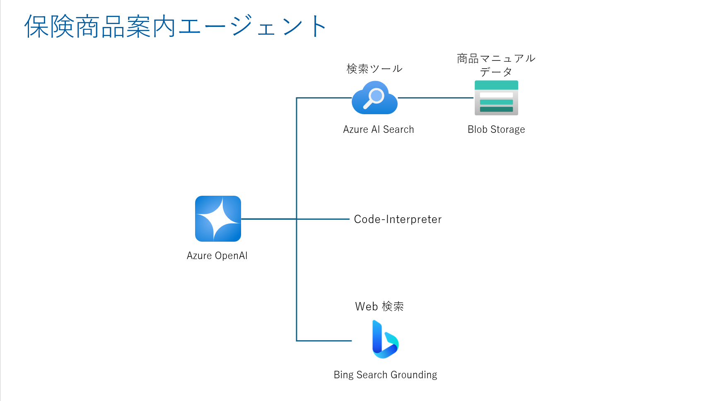
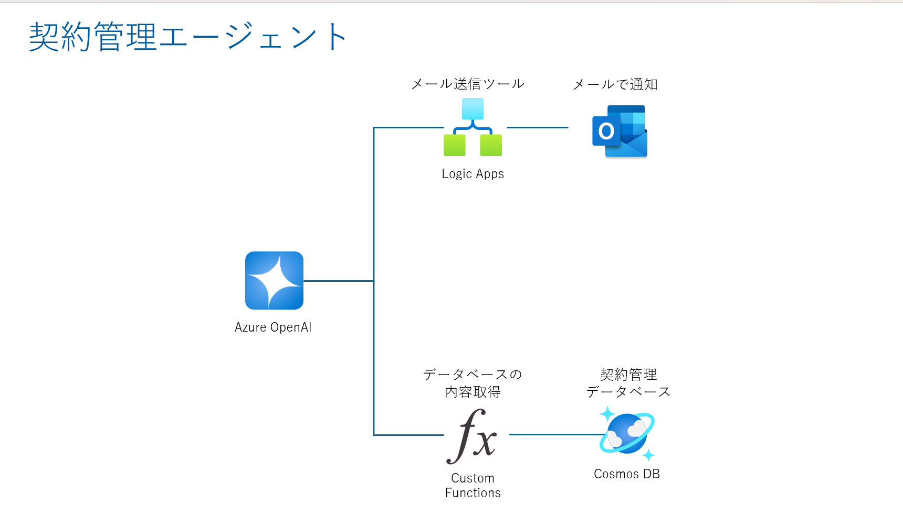

# Azure-AI-Agent-Handson
## 目次
0. [事前準備とリソースの作成](handson-textbook/ex0.md)
1. [保険商品案内エージェントの作成](handson-textbook/ex1.md)
2. [契約管理エージェントの作成](handson-textbook/ex2.md)
3. [AutoGen でのマルチエージェント実装(前編)](handson-textbook/ex3.md)
4. [AutoGen でのマルチエージェント実装(後編)](handson-textbook/ex4.md)
5. [マルチエージェントの実装における考慮点](handson-textbook/ex5.md)

## ハンズオンで実施する内容
- 対象：Azure で RAG の構築を python で行ったことがある方
- 目的：
    - Azure PaaS を用いたツール実装
    - Azure AI Agent Service でのツール呼び出しとシングルエージェント実装
    - AutoGen によるマルチエージェント実装
    - Chainlit による UI 表示
    - エージェント開発における考慮点に関するディスカッション

## ハンズオンのシナリオとゴール
### サンプルシナリオ：保険業界でカスタマーサポートを行うマルチエージェントシステム
※ シナリオはあくまでサンプルであり、本ハンズオンは各エージェント実装に重点を置いています。

### シングルエージェントの構成図
#### 保険商品案内エージェント

#### 契約管理エージェント

### マルチエージェントの構成図

### 構築する UI のイメージ
下記の gif が見づらい場合は、[こちらの.mp4](images/multiagent.mp4)でご確認ください。

## 注意点および免責事項
- 本番運用を想定した内容ではございません
- AI分野の進化は速いため、最新情報は公式のドキュメントをご確認ください

## 推奨環境と必要なツール
- python 3.11以上
- Windows OS
- Visual Studio Code
- Azure Subscription (無料版はTPM上限が小さいため非推奨)
- Github アカウント (任意)