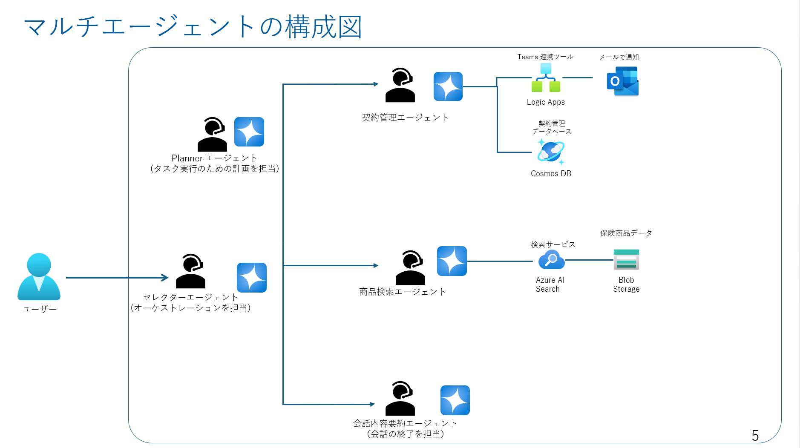

## 目次
0. [事前準備とリソースの作成](ex0.md)
1. [保険商品案内エージェントの作成](ex1.md)
2. [契約管理エージェントの作成](ex2.md)
3. [音声対応エージェントと要約エージェントの作成](ex3.md)
4. [マルチエージェントの実装](ex4.md)
5. [マルチエージェントの実装における考慮点](ex5.md)

## 演習 0-1 :　ハンズオンのゴール

## 演習 0-2 : 事前準備とリソースの作成
この演習 0 で実施するタスクは以下のとおりです。
- リソースの作成
  - Azure AI Foundry Hub
  - Azure AI Foundry Project
    - gpt-4o-2024-08-06 のデプロイ
  - Azure AI Search (S0 or Basic)
  - Bing Grounding Tool 作成
  - Logic Apps 作成
  - (Optional)　Cosmos DB 作成
  - (Optional)　Azure Functions 作成
  - (Optional)　Bicepファイルによるリソース作成
- 開発環境の確認
  - VS Code での python 環境の確認
  - 仮想環境の作成
  - 必要なライブラリのインストール
  - (Optional) Github Codespaces の利用
- app.py の作成と chainlit を使ったチャットUIの設定
  - Optional : [Azure Acrive Directory による認証](https://docs.chainlit.io/authentication/oauth#azure-active-directory)

 

## 次へ

👉 [**演習1：保険商品案内エージェントの作成**](ex1.md)

 

🏚️ [README に戻る](README.md)