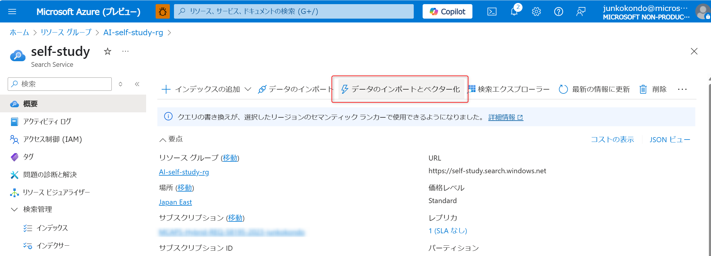

# 演習 1 : 保険商品案内エージェントの作成

この演習 1 で実施するタスクは以下のとおりです。
- RAG 用インデックスの作成
- エージェントの作成
- インデックスをツールとして呼び出せるように登録
- Code Interpreter の登録
- Bing Search Grounding の登録
- エージェントからツールの呼び出し

## 演習 1-1 保険商品に関するインデックスを作成する

1. サンプルデータをダウンロード

2. Storage にアップロード

3. Azure AI Search でのインデックス化

- 手動でRBACの割り当てが必要
- Azure AI Foundry Hub リソース作成時にできたストレージに対して、Azure AI Seardh の Blob データ閲覧者権限を付与する
- 統合されたベクトル化に対して、Azure AI Service (複数AIが使えるリソース)が対応しておらず、別途デプロイが必要

## 演習 1-2 保険商品案内エージェントの作成
<!-- .py でモジュール化すればいいのかしら -->
1. VScode で agents フォルダを作成する

## 演習 1-2 関数の定義
- Azure AI Search の検索
- Code Interpreter 追加
- Bing Search

## 演習 1-3 動作の確認

 

## 次へ

👉 [**演習2 : 契約管理エージェントの作成**](ex2.md) 

 

🏚️ [README に戻る](README.md)