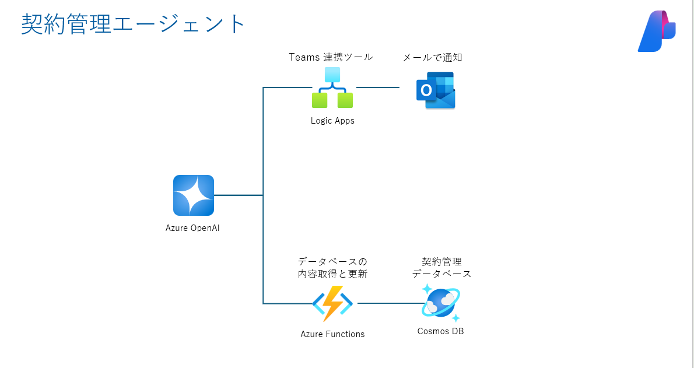

# 演習 2 : 契約管理エージェントの作成
この演習 2 で実施するタスクは以下のとおりです。
- Cosmos DB 取得 (Optional)
- Logic Apps でのフロー作成

## 演習 2-1 Logic Apps の設定
- Logic Apps リソース作成
- メールの送信設定

## 演習 2-2 Azure Functions の呼び出し
- Azure Functions の API 仕様の説明

## 演習 2-3 関数の定義
- Logic Apps 追加
- Azure Functions 追加

## 演習 2-4 動作の確認

 

## 次へ

👉 [**演習3 :音声対応エージェントと要約エージェントの作成**](ex3.md) 

 

🏚️ [README に戻る](README.md)