# 演習 2 : 契約管理エージェントの作成
この演習 2 で実施するタスクは以下のとおりです。
- Cosmos DB からユーザー情報を取得
- Logic Apps でメール送信を実行

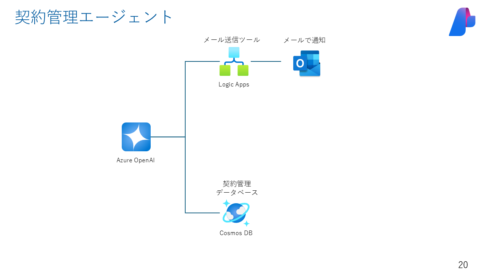

## 演習 2-1 Logic Apps の作成
1. [Azure portal](https://portal.azure.com/) で、Azure アカウントを使ってサインイン
2. Azure portal の検索ボックスに「logic app」と入力し、[Logic Apps] を選択

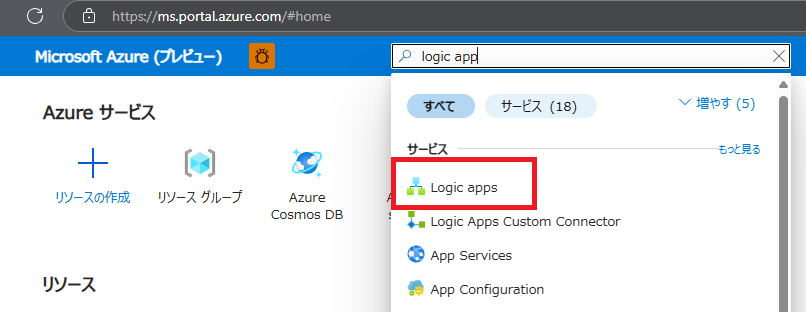

3. [Add （もしくは「追加」）]を押下

4. 従量課金の「マルチテナント」を選択し、[選択] を押下

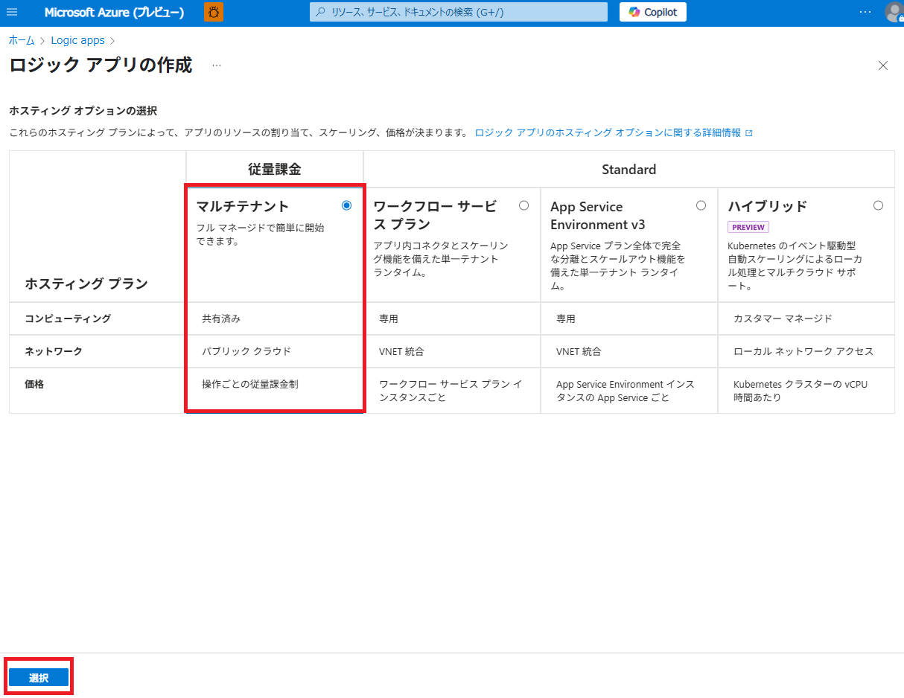

5. [基本] タブで、次の情報を入力

| プロパティ | 値 | 備考 |
| --- | ---| ---|
| サブスクリプション | <Azure サブスクリプション名> | |
| リソース グループ |<Azure リソース グループ名> ||
| ロジック アプリ名 |  <Logic Apps 名> ||
| リージョン |  <リージョン名> | |
| ログ分析を有効化 |  いいえ | |

> ※ 完了すると、設定は次の例のようになります。

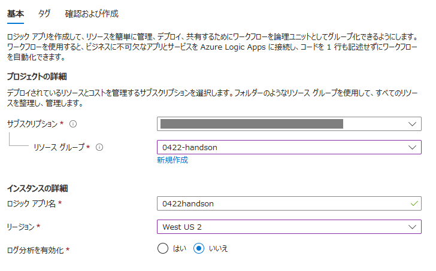

6. [確認および作成] を押下し、問題なければ [作成] を押下
7. 正常にデプロイできたら、[リソースに移動] を選択
8. リソースに移動したら、開発ツールの[リソースビジュアライザー] を押下

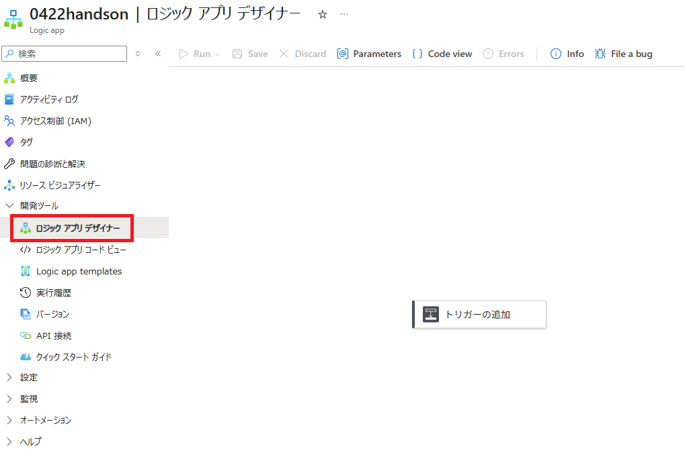

9. [トリガーの追加] から [Request] を選択し、[When a HTTP is received] を押下

10. [パラメータ] タブで、[Method] を「POST」に選択し、[Request Body JSON Schema] に以下のjsonをコピペ

```json
{
    "type": "object",
    "properties": {
        "customer": {
            "type": "string"
        },
        "inquiry": {
            "type": "string"
        },
        "staff_email": {
            "type": "string"
        }
    }
}
```
> ※ 完了すると、設定は次の例のようになります。

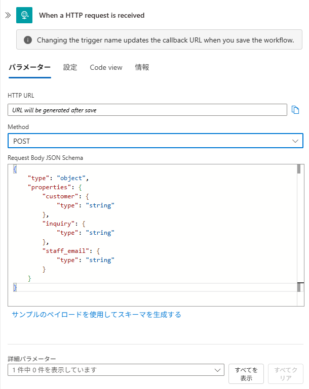

11. 「When a HTTP request is received」 の後に、新しいステップを追加

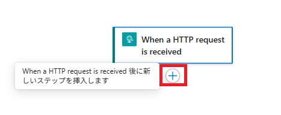

12. アクションの追加で [メールを送信] を検索し、Outlook.com の [メールの送信（V2）] を選択

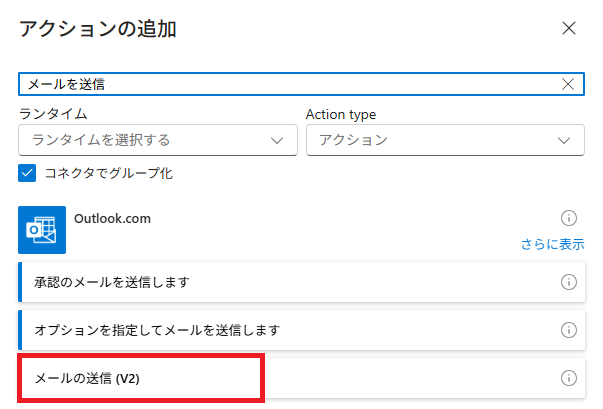

13. [サインイン] が求められるので、Microsoft アカウントでサインイン

14. [パラメータ] タブで、、次の情報を入力

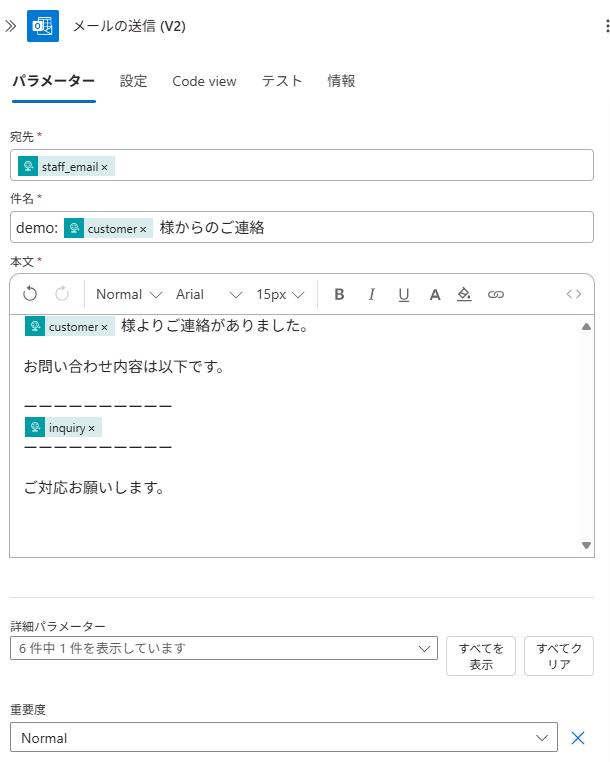

15. メールを送信（V2）の後に新しいステップを追加
16. [Response] を検索し、Request の [Response] を選択
17. Response アクションは以下のようにデフォルトのままでOK

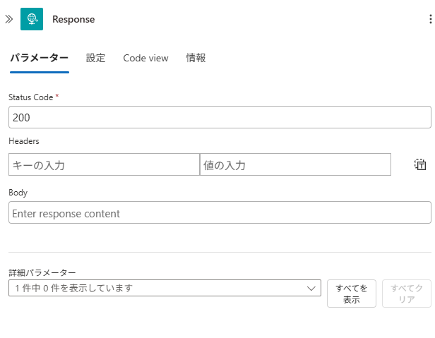

18. [Save] を押下すると、[When a HTTP request is received] の 「HTTP URL」が発行されるためコピーしてメモしておく（後ほど使用）

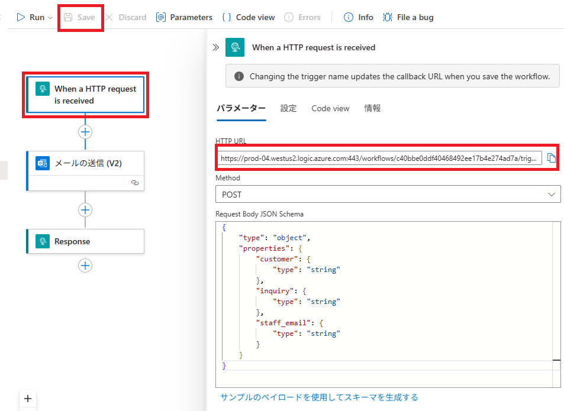

## 演習 2-2 Cosmos DB for NoSQL の作成
1. Azure portal の検索ボックスに「Cosmos DB」と入力し、[Cosmos DB] を選択

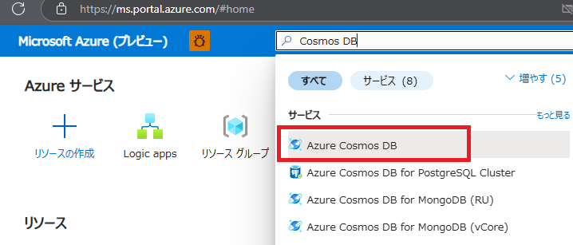

2. [Add （もしくは「追加」）]を押下し、[Azure Cosmos DB for NoSQL] の [作成] を押下

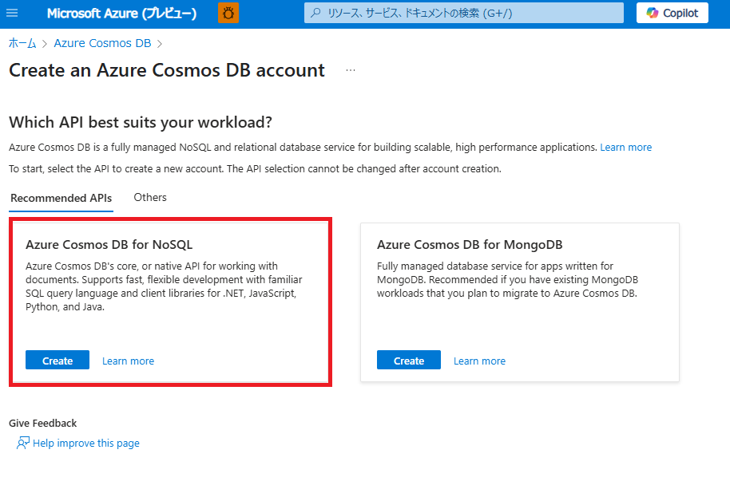

3. [Basics（もしくは基本情報）] タブにて、以下のようにパラメータを入力し、[レビュー+作成] を押下

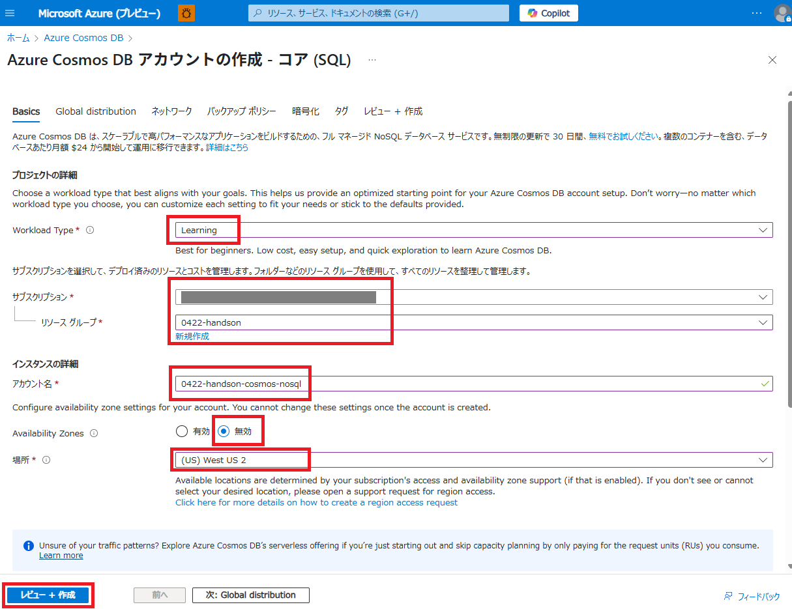

4. 内容を確認し、問題なければ [作成] を押下。デプロイが完了するまで待機。

> ※ 「Free tier is not supported for Internal subscriptions」などのエラーが出た場合は、[Workload Type] を [Development / Testing] にして再度新規作成を試みてください。

5. デプロイが完了したら、[リソースに移動] を押下

6. [データ エクスプローラー] を選択し、[New Container] を押下し、次のパラメータを入力し [OK] を押下

| プロパティ |  値 | 備考 |
| --- | ---|  ---|
| Database Id (Create new) | cosmicworks | |
| Container Id |  users ||
| Partition Key | /plan ||

※ 完了すると、設定は次の例のようになります。

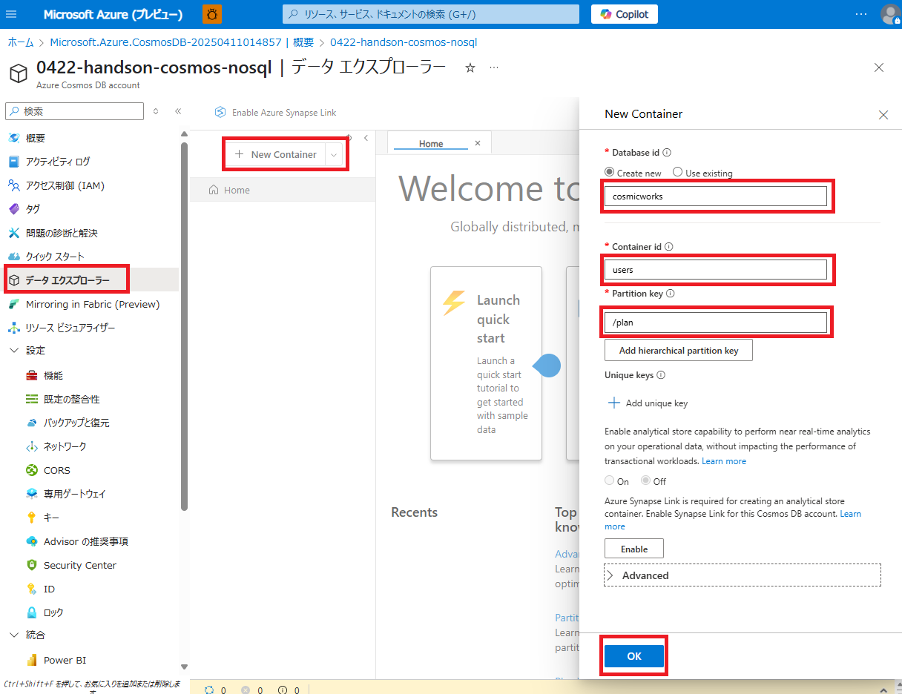

7. データ エクスプローラーのツリーで、[users] コンテナーを展開し、[Items] を選択し、[New Item] を押下

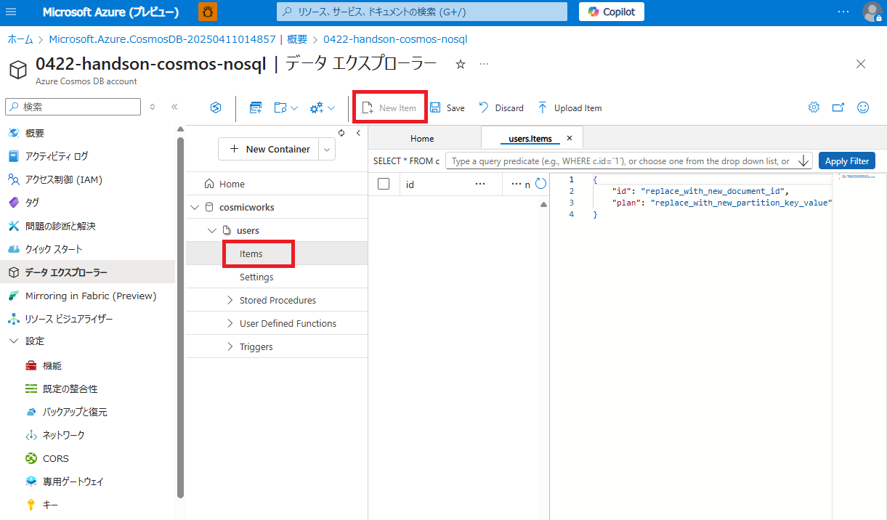

8. 当リポジトリの `./sampledata/users` ディレクトリ配下の 3 つのファイルをローカルに保存し、[Upload Item] からアップロード

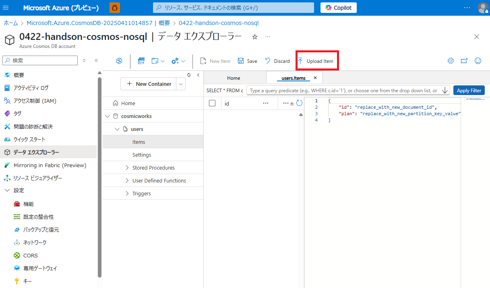

アップロードが成功すると以下のようになります。

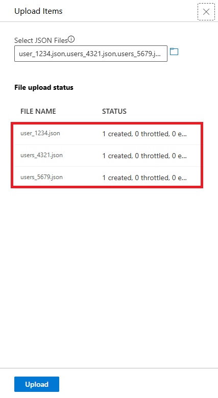

9. Items をリロードすると、各 Item が追加されているのを確認

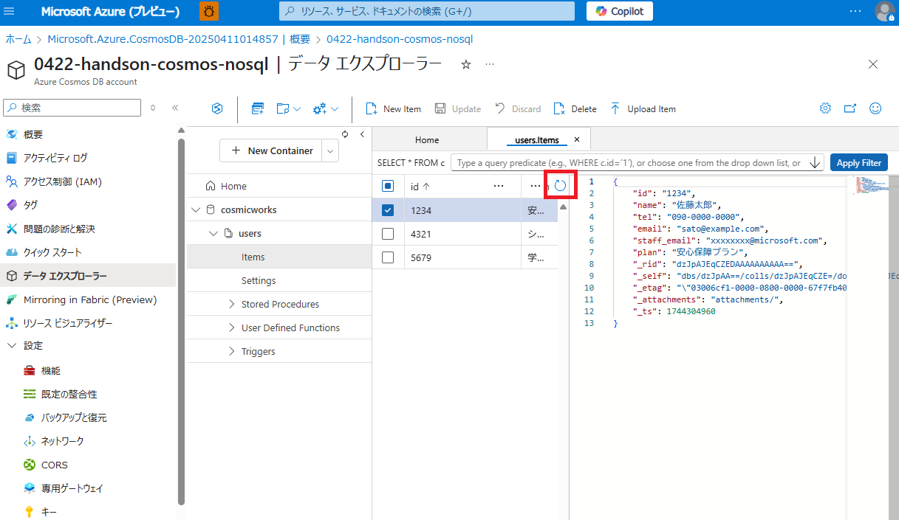


## 演習 2-3 動作確認
次のノートブックから、動作確認を行ってください。

[contract_lookup_agent.ipynb](single-agent/contract_lookup_agent.ipynb)

<br>

## 次へ

👉 [**演習3 :音声対応エージェントと要約エージェントの作成**](ex3.md) 

<br>

<hr>

🏚️ [README に戻る](README.md)