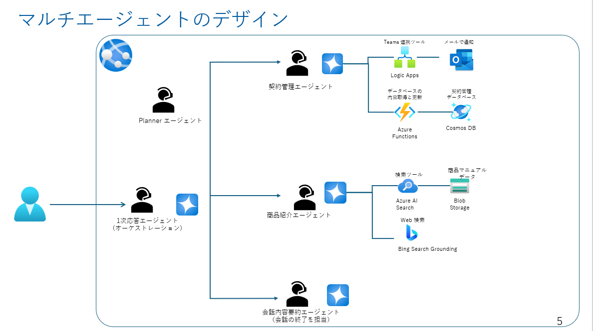

## 目次
0. [事前準備とリソースの作成](ex0.md)
1. [保険商品案内エージェントの作成](ex1.md)
2. [契約管理エージェントの作成](ex2.md)
3. [AutoGen でのマルチエージェント実装(前編)](ex3.md)
4. [AutoGen でのマルチエージェント実装(後編)](ex4.md)
5. [マルチエージェントの実装における考慮点](ex5.md)

## ハンズオンのゴール
### 構成図


### 構築する UI のイメージ


## 演習 0-1 : 開発環境の確認
- 開発環境の確認
  - VS Code での python 環境の確認
  - 仮想環境の作成
  - 必要なライブラリのインストール
  - (準備中) Github Codespaces の利用


※ コマンドは環境に応じて適宜読みかえてください。下記は Windows Powershell の場合の例です。
1. リポジトリをクローン\
```git clone https://github.com/JnkKnd/Azure-AI-Agent-Handson.git```
1. 仮想環境を作成（python の version は 3.11 以上をお使いください） \
```python -m venv .venv```
1. 仮想環境を有効化 \
```./.venv/Scripts/activate``` 
1. 必要なライブラリをインストール \
```pip install -r requirements.txt```

## 演習 0-2 : 事前準備とリソースの作成
この演習 0 で実施するタスクは以下のとおりです。
- リソースの作成
  - Azure AI Foundry Hub
  - Azure AI Foundry Project
    - gpt-4o-2024-08-06 のデプロイ

また、演習中に作成するリソースは以下の通りです。
  - Azure AI Search (S0 or Basic)
  - Bing Grounding Tool
  - Logic Apps
  - Cosmos DB
　- (Optional) App Service 

### Azure AI Foundry の作成
1. [Azure portal](https://portal.azure.com/) にアクセスして「リソースの作成」をクリックします。
1. 上部のテキストボックスに「Azure AI Foundry」と入力して検索します。以下のように Azure AI Foundry が表示されたら作成をクリックします。


1. 必要事項を以下のように入力して「確認および作成」をクリックします。※今回は「**East US 2**」リージョンに作成します。


1. 内容を確認して「作成」ボタンをクリックします。


    以下のリソースが自動的に新規作成されます。

    - Azure AI Foundry ハブ
    - Azure AI services
      - Azure OpenAI Service
    - ストレージアカウント
    - キー コンテナー


1. リソースのデプロイが完了したら、リソースへ移動し「Azure AI Foundry の起動」ボタンをクリックします。

### Azure AI Studio プロジェクトの作成
1. Azure AI Studio を起動したら、最上位階層「ハブ」に新しいプロジェクトを作成します。以下のように「新しいプロジェクト」ボタンをクリックします。

1. 任意のプロジェクト名を入力して「プロジェクトを作成する」ボタンをクリックします。

1. プロジェクトが作成されると、以下のようなプロジェクト概要画面が開きます。これでプロジェクトごとにプロンプトフローを構築・管理できるようになります。

### Azure OpenAI モデルのデプロイ
1. 左のメニューから「デプロイ」を選択して「モデルのデプロイ」を選択し、「基本モデルをデプロイする」をクリックします。

1. 今回は `gpt-4o` のモデルバージョン `2024-08-06` を使用します。（Grounding with Bing に対応しているモデルのため ）以下のようにモデルを選択し「確認」ボタンをクリックします。

1.  以下のようにデプロイ設定を行います。デプロイの種類は「グローバル標準」に設定します。トークンレート制限は少なめの値で問題ありません。特に同一リージョン内に他の Azure OpenAI リソースがある場合はクォータキャップに注意してください。

「デプロイ」ボタンをクリックするとすぐにデプロイされます。


<br>

## 次へ

👉 [**演習1：保険商品案内エージェントの作成**](ex1.md)

<br>

<hr>

🏚️ [README に戻る](../README.md)