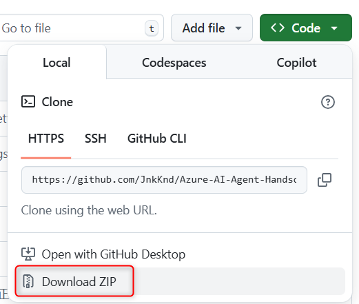
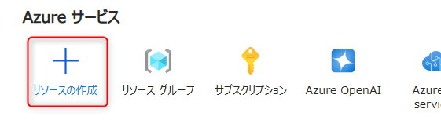
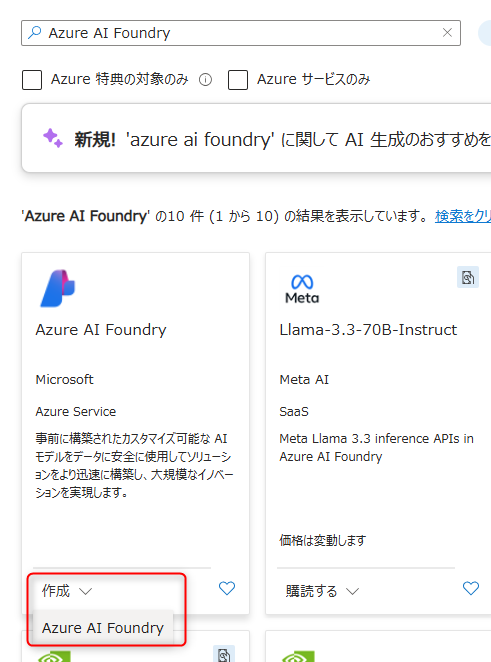
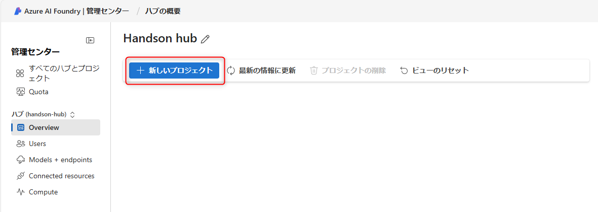
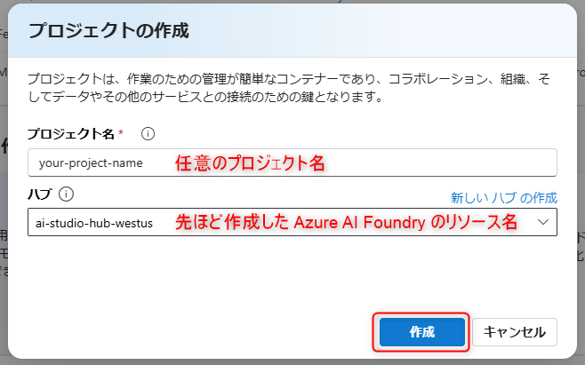
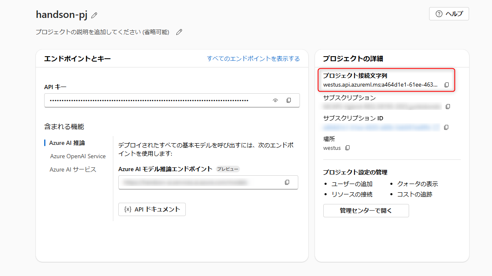
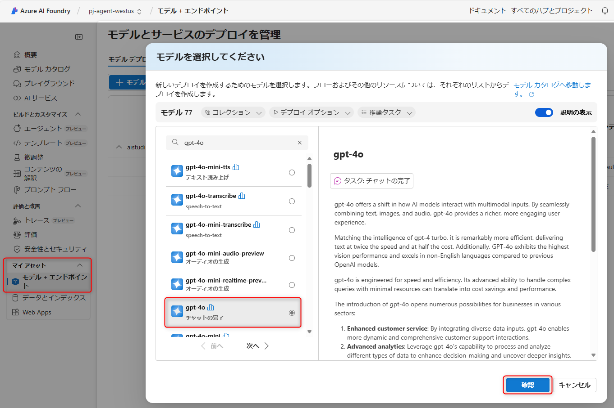
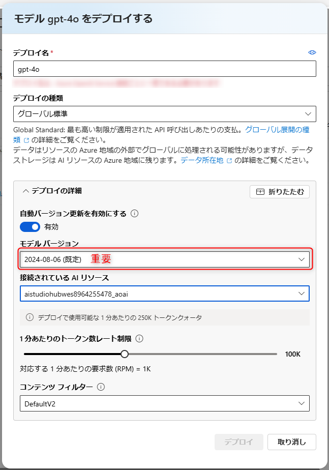
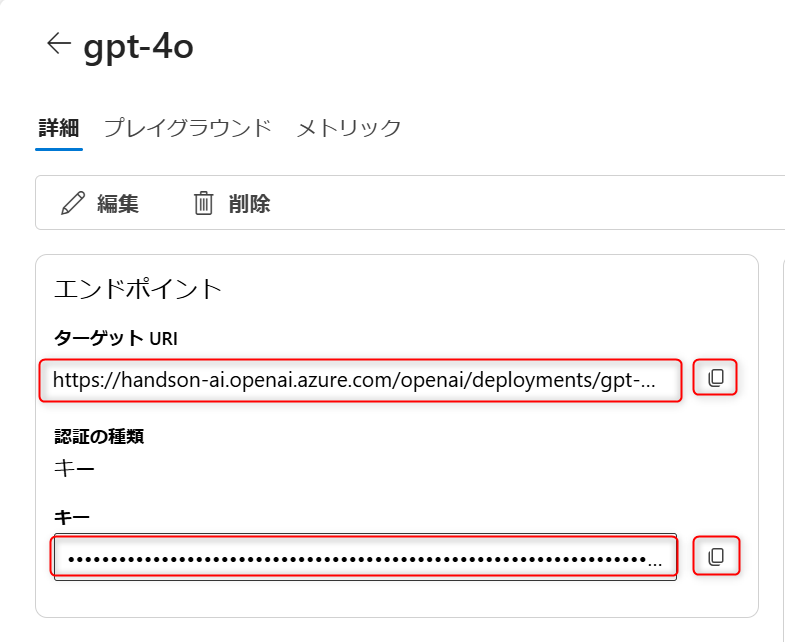

## 目次
0. [事前準備とリソースの作成](ex0.md)
1. [保険商品案内エージェントの作成](ex1.md)
2. [契約管理エージェントの作成](ex2.md)
3. [AutoGen でのマルチエージェント実装(前編)](ex3.md)
4. [AutoGen でのマルチエージェント実装(後編)](ex4.md)
5. [マルチエージェントの実装における考慮点](ex5.md)

## 演習 0-1 : 開発環境の確認
### 必要事項
  - Azure Subscription の確認
  - ローカルで実行する場合：
    - Visual Studio Code の確認
    - python version の確認 (3.11 以上推奨)
      - 3.11 以下のバージョンをお使いの場合、[Python 3.11.9](https://www.python.org/downloads/release/python-3119/)をダウンロードしてください
      - インストーラー実行の際は 「Add Python 3.11 to PATH」 にチェックを必ず入れてください

### Github Codespaces を利用する場合
※ Azure AI Agent SDK の認証でエラーがでる可能性がございます。
1. Github にご自身のアカウントでサインイン

1. https://github.com/JnkKnd/Azure-AI-Agent-Handson にアクセスし、main ブランチであることを確認

1. [Code]ボタンをクリックし、[Codespaces]タブを選択し、[Create Codespace]をクリックします。

    

1. python 3.11 系が使える状態で、環境が立ち上がります。仮想環境作成や依存関係のインストールを行っていきます。

1. python のバージョン確認
    ```
    python --version
    ```

2. 仮想環境の作成
    ```
    python -m venv .venv
    ```

3. 仮想環境の有効化
    ```
    source .venv/bin/activate
    ```

4. pip の最新化
    ```
    python -m pip install --upgrade pip
    ```

5. 依存関係のインストール
    ```
    pip install -r ./requirements.txt
    ```

6. Azure CLI のインストール
    ```
    curl -sL https://aka.ms/InstallAzureCLIDeb | sudo bash

    ```

7. Azure へのログイン
    ```
    az login --use-device-code
    ```

8. `.env-sample`をコピーし、同じ階層に `.env`ファイルとして保存
    ```
    cp .env-sample .env
    ```

### ローカルで実施する場合
※ 下記は Windows Powershell の場合の例です。コマンドは環境に応じて適宜読みかえてください。


1. リポジトリをクローン
    [git](https://git-scm.com/downloads/win) がインストールされている方：
    ```
    git clone https://github.com/JnkKnd/Azure-AI-Agent-Handson.git
    ```
    
    git がインストールされていない方：zip にしてダウンロードしてください
    

1. ディレクトリに移動
    ```
    cd ./Azure-AI-Agent-Handson
    ```

1. 仮想環境を作成（python の version は 3.11 以上をお使いください）\
    ```
    py -3.11 -m venv .venv
    ```
    3.11 以下のバージョンをお使いの場合、[Python 3.11.9](https://www.python.org/downloads/release/python-3119/)をダウンロードしてください。\
    インストーラー実行の際は 「Add Python 3.11 to PATH」 にチェックを必ず入れてください。
    
    `py -3.11 -m venv .venv` のコマンドが通らない場合は 
    ```
    python -m venv .venv
    ```
    で仮想環境を作成してください。

1. 仮想環境を有効化
    ```
    ./.venv/Scripts/activate.ps1
    ``` 
    コマンド実行後、powershell では左端に (.venv)と表示されます

1. python の version を確認
    ```
    python --version
    ```
    ここで python 3.11 以上が表示されればOKです。

1. pip を最新にします
    ```
    python -m pip install --upgrade pip
    ```

1. 必要なライブラリをインストール
    ```
    pip install -r ./requirements.txt
    ```

1. `.env-sample`をコピーし、同じ階層に `.env`ファイルとして保存
    ```
    copy .env-sample .env
    ```


### ディレクトリの構造について
今回のハンズオンのディレクトリ構造は下記の通りです。
```
.
└── Azure-AI-Agent-Handson
    ├── autogen-multiagent
    │   ├── autogen-multiagent.ipynb 演習3で用いるノートブック
    │   └── (略)
    ├── handson-textbook
    │   ├── ex0.md 演習0
    │   ├── ex1.md 演習1
    │   ├── ex2.md 演習2
    │   ├── ex3.md 演習3
    │   ├── ex4.md 演習4
    │   └── ex5.md 演習5
    ├── sampledata
    │   ├── users サンプルのユーザーデータが入っているフォルダ
    │   ├── code-interpreter-sample コードインタープリターで生成される画像のサンプル
    │   └── product_info.md 保険商品のサンプルデータ
    ├── single-agent
    │   ├── contract_lookup_agents.ipynb 演習2で用いるノートブック
    │   └── product_search_agents.ipynb　演習1で用いるノートブック
    └── sk-multiagent
        └── sk-multiagent.ipynb Semantic Kernel を勉強するノートブック
```


## 演習 0-2 : 事前準備とリソースの作成
この演習 0 で実施するタスクは以下のとおりです。
- リソースの作成
  - Azure AI Foundry Hub
  - Azure AI Foundry Project
    - gpt-4o-2024-08-06 のデプロイ
  - Azure OpenAI Service
    - text-embedding-ada-002 のデプロイ

また、演習中に作成するリソースは以下の通りです。
  - Azure AI Search (S0 or Basic)
  - Bing Grounding Tool
  - Logic Apps
  - Cosmos DB

### Azure AI Foundry の作成
1. [Azure portal](https://portal.azure.com/) にアクセスして「リソースの作成」をクリックします。\
  

1. 上部のテキストボックスに「Azure AI Foundry」と入力して検索します。以下のように Azure AI Foundry が表示されたら作成をクリックします。仮に２つ表示された場合、下記画像と同じものから作成してください。\
  

2. 必要事項を以下のように入力して「確認および作成」をクリックします。\
※今回は「**West US**」リージョンに作成します。\

| 項目               | 値                                      |
|--------------------|------------------------------------------|
| サブスクリプション | ご自身が使う予定のサブスクリプション     |
| リソースグループ   | 新規作成を選択し、任意のリソースグループ名をつける |
| リージョン         | West US                                 |
| リソースの名前     | 任意                          |
| OpenAI を含む AI サービスに接続する| 新規作成を選択し、任意のリソース名をつける|

3. その他の設定はデフォルト値のままで構いません。[確認および作成]を押下し、内容を確認して問題なければ[作成]をクリックします。


    以下のリソースが自動的に新規作成されます。

    - Azure AI Foundry ハブ
    - Azure AI services
      - (Azure OpenAI Service もこの Azure AI Service に含まれます)
    - Storage Account
    - キー コンテナー


4. リソースのデプロイが完了したら、リソースへ移動し「Launch Azure AI Foundry」をクリックします。

### Azure AI Foundry プロジェクトの作成
1. Azure AI Foundry を起動したら、最上位階層「ハブ」に新しいプロジェクトを作成します。以下のように「新しいプロジェクト」ボタンをクリックします。\
  

1. 任意のプロジェクト名を入力して「プロジェクトを作成する」をクリックします。\
  UI が異なる場合がございますが、ハブの欄に先ほど作成した Azure AI Foundry Hub リソースが作成されていればOKです。
  

1. プロジェクトが作成されます。これでプロジェクトごとにエージェントを構築・管理できるようになります。ここで、後続の手順のために、プロジェクトの接続文字列をメモしておきます。プロジェクトの概要欄にある、接続文字列をコピーします。
  

1. メモ帳などにメモをしておくか、 `.env`ファイルに直接追記してもOKです。
    ```
    PROJECT_CONNECTION_STRING="コピーした接続文字列"
    ```


### GPT-4o モデルのデプロイ
1. Azure AI Foundry Portal の左メニューの下部にある[マイアセット]内の[モデル＋エンドポイント]を選択して[モデルのデプロイ]を選択し、[基本モデルをデプロイする]をクリックします。

1. 今回は `gpt-4o` のモデルバージョン `2024-08-06` を使用します。（Grounding with Bing に対応しているモデルのため ）以下のようにモデルを選択し「確認」ボタンをクリックします。\
  

1.  以下のようにデプロイ設定を行います。デプロイの種類は「グローバル標準」に設定します。特に同一リージョン内に他の Azure OpenAI リソースがある場合はクォータキャップに注意してください。 「デプロイの詳細」の右上にある「カスタマイズ」を選択し、モデルバージョンを 「2024-08-06」に指定してください。また「1分あたりのトークン数レート制限」の値が小さい場合は引き上げてください。50K程度あれば十分です。
  

「デプロイ」ボタンをクリックするとすぐにデプロイされます。

1. デプロイが完了すると、完了画面が表示されます。ここで、Azure OpenAI のエンドポイントとキーをメモしておきます。
下記の画像の、ターゲットURIの `https://<hub リソース名>.openai.azure.com` の部分がエンドポイントです。（`openai.azure.com` 以降のURLは不要です）キーも同様にコピーします。

    

1. コピーした内容は下記のようにメモ帳にメモしておきます。もしくは`.env`ファイルに追加しても構いません。デプロイ名はデフォルト値の場合 `gpt-4o`です。
    ```
    AZURE_OPENAI_ENDPOINT ="コピーしたエンドポイント"
    AZURE_OPENAI_KEY ="コピーしたキー"
    DEPLOYMENT_NAME ="gpt-4o"
    ```

### Azure OpenAI Service の作成と Embedding モデルのデプロイ

>**※注意**\
>この手順は演習1で、 Azure AI Search の **データのインポートとベクター化** 機能を用いる際に Azure OpenAI Service リソースの embedding モデルが必要となるため行います。一つ前の手順でデプロイした Azure AI Foundry リソース作成時につくられる Azure AI Services とは**別で**、Azure OpenAI リソースを作成します。


1. [Azure portal](https://portal.azure.com/) にアクセスして「リソースの作成」をクリックします。\
  

1. 上部のテキストボックスに「Azure OpenAI」と入力して検索し、作成をクリックします。

1. 設定項目を下記のようにしてください。

    | 項目 | 値 |
    | --- | --- |
    |リソースグループ|今回作成したリソースグループを選択|
    |リージョン| West US|
    |名前| 任意 |
    |価格レベル| Standard S0|

    

1. 入力を追えたら、[次へ]を選択し、その他の設定はデフォルト値のまま進めます。
  [レビューおよび送信]タブで、確認をしたら[作成]を選択します。\
  Azure OpenAI リソースがデプロイされるのを待ちます。

1. デプロイ後、[リソースに移動]を新たに作成された Azure OpenAI Service を展開します。[Launch Azure AI Foundry Portal]を選択します。\
  ※左上に **Azure AI Foundry | Azure OpenAI Service**とあり、こちらは project とは別の画面です。

1. 左側の[共有リソース]の[デプロイ]を選択します。
    
1. 左のメニューの下部にある「マイアセット」内の「モデル＋エンドポイント」を選択して「モデルのデプロイ」を選択し、「基本モデルをデプロイする」をクリックします。

1. `text-embedding-ada-002` のモデルを選択します。以下のようにモデルを選択し「確認」ボタンをクリックします。


1.  デプロイ設定は、デフォルト値のままで構いません。デプロイの種類は「グローバル標準」に設定します。


「デプロイ」ボタンをクリックするとすぐにデプロイされます。

演習0はこれで終了です。モデルを利用する準備ができました。\
次は Azure AI Agent Service についての座学を行ったのち、演習1でシングルエージェントを実装していきます。


<br>

## 次へ

👉 [**演習1：保険商品案内エージェントの作成**](ex1.md)

<br>

<hr>

🏚️ [README に戻る](../README.md)