## 目次
0. [事前準備とリソースの作成](ex0.md)
1. [保険商品案内エージェントの作成](ex1.md)
2. [契約管理エージェントの作成](ex2.md)
3. [AutoGen でのマルチエージェント実装(前編)](ex3.md)
4. [AutoGen でのマルチエージェント実装(後編)](ex4.md)
5. [マルチエージェントの実装における考慮点](ex5.md)

## 演習 0-1 : 開発環境の確認
### 必要事項
  - Azure Subscription の確認
  - ローカルで実行する場合：
    - Visual Studio Code の確認
    - python version の確認 (3.11 以上推奨)
      - 3.11 以下のバージョンをお使いの場合、[Python 3.11.9](https://www.python.org/downloads/release/python-3119/)をダウンロードしてください
      - インストーラー実行の際は 「Add Python 3.11 to PATH」 にチェックを必ず入れてください

## Github Codespaces を利用する場合
### 1.1 リポジトリへのアクセス

1. [Azure-AI-Agent-Handson](https://github.com/JnkKnd/Azure-AI-Agent-Handson) にアクセス
2. `20250929` ブランチであることを確認

### 1.2 Codespaces の起動

1. **[Code]** ボタンをクリック
2. **[Codespaces]** タブを選択  
3. **[Create Codespace]** をクリック

    > **自動設定**: Python 3.11系とすべての必要ツールが自動でインストールされます

### 1.3 環境の確認

ターミナルを開いて、必要なツールがインストールされていることを確認：

```bash
# Python バージョン確認
python --version

# PostgreSQL クライアント確認  
psql --version

# Azure CLI 確認
az --version
```

> **期待される結果**: すべてのコマンドでバージョン情報が表示される

## Step 2: Azure インフラストラクチャの構築

### 2.1 Azure アカウントへのログイン

```bash
az login --use-device-code
```

> **認証プロセス**: ブラウザで表示されるコードを入力してAzureアカウントにログイン

### 2.2 Python 依存関係のインストール

ワークショップに必要なライブラリをCodespaces環境にインストール：

```bash
pip install -r ./requirements.txt
```

> **インストール内容**: Azure AI SDK、Semantic Kernel、データベースクライアントなど

### 2.3 Azure リソースの自動作成

以下のコマンドで必要なAzureリソースを一括作成：

```bash
bash ./infra/init_setup.sh
```

#### 作成されるリソース

| リソース | 用途 | 詳細 |
|---------|------|------|
| **Azure AI Foundry** | AIモデル管理 | プロジェクト基盤 |
| **Azure AI Foundry Project** | エージェント開発 | GPT-4.1-miniモデル含む |
| **Azure Database for PostgreSQL** | 構造化データ | SQLクエリ学習用 |
| **Azure Cosmos DB for NoSQL** | 非構造化データ | NoSQLクエリ学習用 |

> **注意**: Azure OpenAI モデルのTPM（Tokens Per Minute）クォータ制限に注意してください

### 2.4 リソース作成の確認

1. [Azure Portal](https://portal.azure.com/) にアクセス
2. 「**リソース グループ**」で検索
3. 作成されたリソースグループを確認

    

## Step 3: 環境変数の設定

作成したAzureリソースの接続情報を環境変数ファイル（`.env`）に設定します。

### 3.1 Azure AI Foundry 接続情報

1. [Azure AI Foundry Portal](https://ai.azure.com/?cid=learnDocs) にアクセス
2. **[ライブラリ]** > **[Azure AI Foundry]** を選択
3. **Azure AI Foundry プロジェクト エンドポイント** をコピー
4. `.env` ファイルの `PROJECT_ENDPOINT` に設定

> **権限エラーの場合**: Azure AI ユーザー ロールが未割り当ての場合、アラートの **[修正]** ボタンで自動権限付与


### 3.2 Azure OpenAI 接続情報

1. **[モデル + エンドポイント]** > **[gpt-4.1-mini]** を選択
2. **ターゲット URI** → `.env` の `AZURE_OPENAI_ENDPOINT` に設定
3. **キー** → `.env` の `AZURE_OPENAI_KEY` に設定


## Step 4: MCP サーバーの起動

Model Context Protocol（MCP）サーバーを起動して、エージェント間の通信を有効にします。

### 4.1 MCP サーバーの起動

新しいターミナルウィンドウで以下のコマンドを実行：

```bash
python .\infra\backend_services\mcp_server.py
```

> **重要**: このターミナルは閉じないでください。MCPサーバーが継続実行される必要があります。

> **ヒント**: 新しい作業用ターミナルを別途開いてください。

### 4.2 MCP サーバーの動作確認（オプション）

[MCP Inspector](https://github.com/modelcontextprotocol/inspector) を使用してWeb UIでサーバーの動作を確認できます：

```bash
# 新しいターミナルタブで実行
npx @modelcontextprotocol/inspector
```

> **結果**: ローカルホストにWeb UIが起動し、MCPサーバーの状態を確認可能


### 次のステップ

セットアップが完了したら、学習を開始しましょう：

1. **[README.md](./README.md)** で学習コンテンツを確認
2. **Azure AI Foundry Agent Service** から始める（推奨）
3. **Semantic Kernel** で高度な機能を学習

## トラブルシューティング

### よくある問題と解決方法

#### Azure OpenAI クォータエラー
```
Error: TPM (Tokens Per Minute) quota exceeded
```
**解決策**: [Azure Portal](https://portal.azure.com) でクォータ設定を確認・増加申請

#### 環境変数エラー
```
Error: Environment variable not found
```
**解決策**: `.env` ファイルの設定を再確認し、すべての必須項目が設定されているか確認

#### Python依存関係エラー
```bash
# 依存関係を再インストール
pip install --upgrade -r requirements.txt
```

## ローカルで実施する場合
※ 下記は Windows Powershell の場合の例です。コマンドは環境に応じて適宜読みかえてください。


1. リポジトリをクローン
    [git](https://git-scm.com/downloads/win) がインストールされている方：
    ```
    git clone https://github.com/JnkKnd/Azure-AI-Agent-Handson.git
    ```
    
    git がインストールされていない方：zip にしてダウンロードしてください
    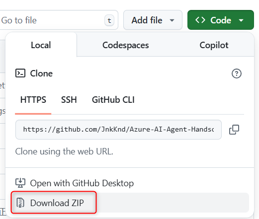

1. ディレクトリに移動
    ```
    cd ./Azure-AI-Agent-Handson
    ```

1. 仮想環境を作成（python の version は 3.11 以上をお使いください）\
    ```
    py -3.11 -m venv .venv
    ```
    3.11 以下のバージョンをお使いの場合、[Python 3.11.9](https://www.python.org/downloads/release/python-3119/)をダウンロードしてください。\
    インストーラー実行の際は 「Add Python 3.11 to PATH」 にチェックを必ず入れてください。
    
    `py -3.11 -m venv .venv` のコマンドが通らない場合は 
    ```
    python -m venv .venv
    ```
    で仮想環境を作成してください。

1. 仮想環境を有効化
    ```
    ./.venv/Scripts/activate.ps1
    ``` 
    コマンド実行後、powershell では左端に (.venv)と表示されます

1. python の version を確認
    ```
    python --version
    ```
    ここで python 3.11 以上が表示されればOKです。

1. pip を最新にします
    ```
    python -m pip install --upgrade pip
    ```

1. 必要なライブラリをインストール
    ```
    pip install -r ./requirements.txt
    ```

1. `.env-sample`をコピーし、同じ階層に `.env`ファイルとして保存
    ```
    copy .env-sample .env
    ```


### ディレクトリの構造について
今回のハンズオンのディレクトリ構造は下記の通りです。
```
.
└── Azure-AI-Agent-Handson
    ├── autogen-multiagent
    │   ├── autogen-multiagent.ipynb 演習3で用いるノートブック
    │   └── (略)
    ├── handson-textbook
    │   ├── ex0.md 演習0
    │   ├── ex1.md 演習1
    │   ├── ex2.md 演習2
    │   ├── ex3.md 演習3
    │   ├── ex4.md 演習4
    │   └── ex5.md 演習5
    ├── sampledata
    │   ├── users サンプルのユーザーデータが入っているフォルダ
    │   ├── code-interpreter-sample コードインタープリターで生成される画像のサンプル
    │   └── product_info.md 保険商品のサンプルデータ
    ├── single-agent
    │   ├── contract_lookup_agents.ipynb 演習2で用いるノートブック
    │   └── product_search_agents.ipynb　演習1で用いるノートブック
    └── sk-multiagent
        └── sk-multiagent.ipynb Semantic Kernel を勉強するノートブック
```


## 演習 0-2 : 事前準備とリソースの作成
この演習 0 で実施するタスクは以下のとおりです。
- リソースの作成
  - Azure AI Foundry Hub
  - Azure AI Foundry Project
    - gpt-4.1-mini-2025-04-14 のデプロイ
  - Azure OpenAI Service
    - text-embedding-ada-002 のデプロイ

また、演習中に作成するリソースは以下の通りです。
  - Azure AI Search (S0 or Basic)
  - Bing Grounding Tool
  - Logic Apps
  - Cosmos DB

### Azure AI Foundry の作成
1. [Azure portal](https://portal.azure.com/) にアクセスして「リソースの作成」をクリックします。\
  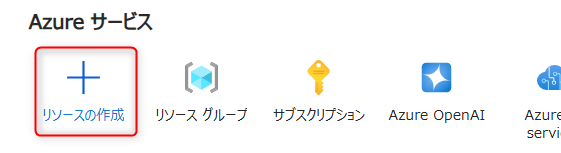

1. 上部のテキストボックスに「Azure AI Foundry」と入力して検索します。以下のように Azure AI Foundry が表示されたら作成をクリックします。仮に２つ表示された場合、下記画像と同じものから作成してください。\
  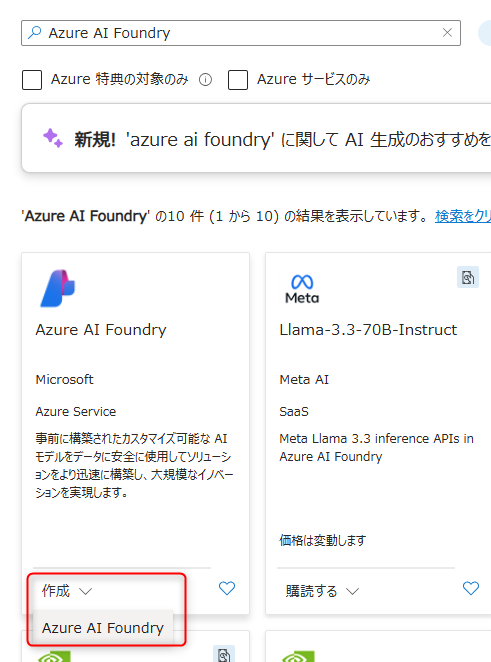

2. 必要事項を以下のように入力して「確認および作成」をクリックします。\
※今回は「**West US**」リージョンに作成します。\

| 項目               | 値                                      |
|--------------------|------------------------------------------|
| サブスクリプション | ご自身が使う予定のサブスクリプション     |
| リソースグループ   | 新規作成を選択し、任意のリソースグループ名をつける |
| リージョン         | West US                                 |
| リソースの名前     | 任意                          |
| OpenAI を含む AI サービスに接続する| 新規作成を選択し、任意のリソース名をつける|

3. その他の設定はデフォルト値のままで構いません。[確認および作成]を押下し、内容を確認して問題なければ[作成]をクリックします。


    以下のリソースが自動的に新規作成されます。

    - Azure AI Foundry ハブ
    - Azure AI services
      - (Azure OpenAI Service もこの Azure AI Service に含まれます)
    - Storage Account
    - キー コンテナー


4. リソースのデプロイが完了したら、リソースへ移動し「Launch Azure AI Foundry」をクリックします。

### Azure AI Foundry プロジェクトの作成
1. Azure AI Foundry を起動したら、最上位階層「ハブ」に新しいプロジェクトを作成します。以下のように「新しいプロジェクト」ボタンをクリックします。\
  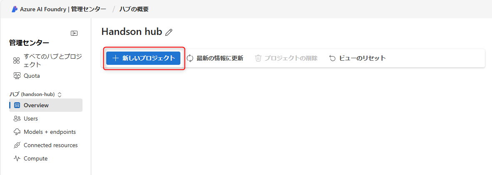

1. 任意のプロジェクト名を入力して「プロジェクトを作成する」をクリックします。\
  UI が異なる場合がございますが、ハブの欄に先ほど作成した Azure AI Foundry Hub リソースが作成されていればOKです。
  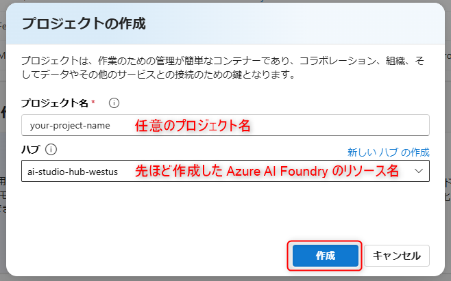

1. プロジェクトが作成されます。これでプロジェクトごとにエージェントを構築・管理できるようになります。ここで、後続の手順のために、プロジェクトのエンドポイントをメモしておきます。プロジェクトの概要欄にある、エンドポイントをコピーします。
  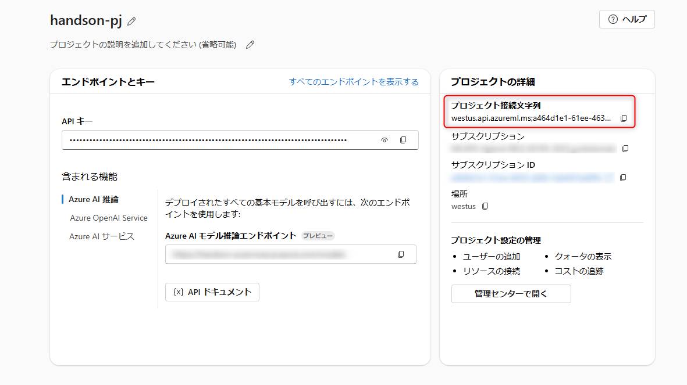

1. メモ帳などにメモをしておくか、 `.env`ファイルに直接追記してもOKです。
    ```
    PROJECT_ENDPOINT="コピーしたエンドポイント"
    ```


### GPT-4.1-mini モデルのデプロイ
1. Azure AI Foundry Portal の左メニューの下部にある[マイアセット]内の[モデル＋エンドポイント]を選択して[モデルのデプロイ]を選択し、[基本モデルをデプロイする]をクリックします。

1. 今回は `gpt-4.1-mini` のモデルバージョン `2025-04-14` を使用します。（Grounding with Bing に対応しているモデルのため ）以下のようにモデルを選択し「確認」ボタンをクリックします。\
  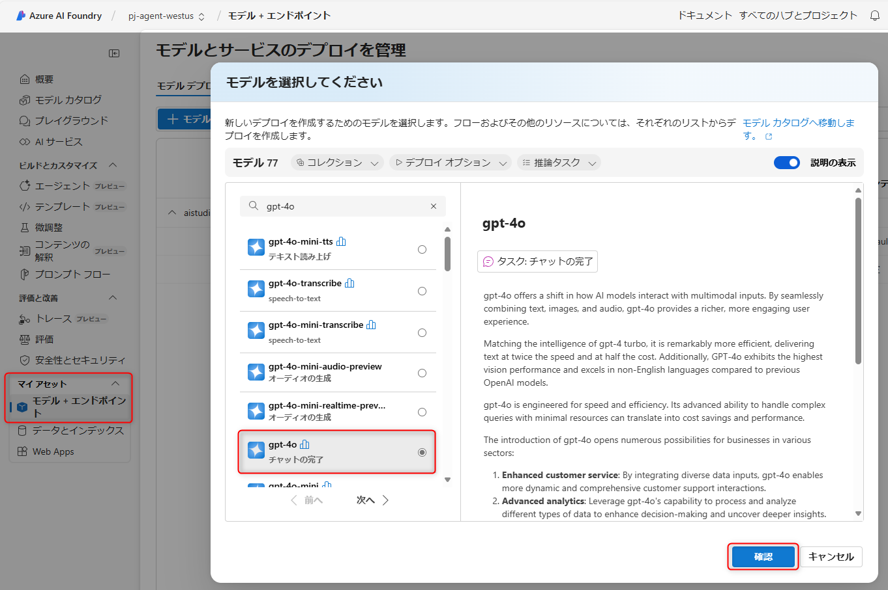

1.  以下のようにデプロイ設定を行います。デプロイの種類は「グローバル標準」に設定します。特に同一リージョン内に他の Azure OpenAI リソースがある場合はクォータキャップに注意してください。 「デプロイの詳細」の右上にある「カスタマイズ」を選択し、モデルバージョンを 「2024-08-06」に指定してください。また「1分あたりのトークン数レート制限」の値が小さい場合は引き上げてください。50K程度あれば十分です。
  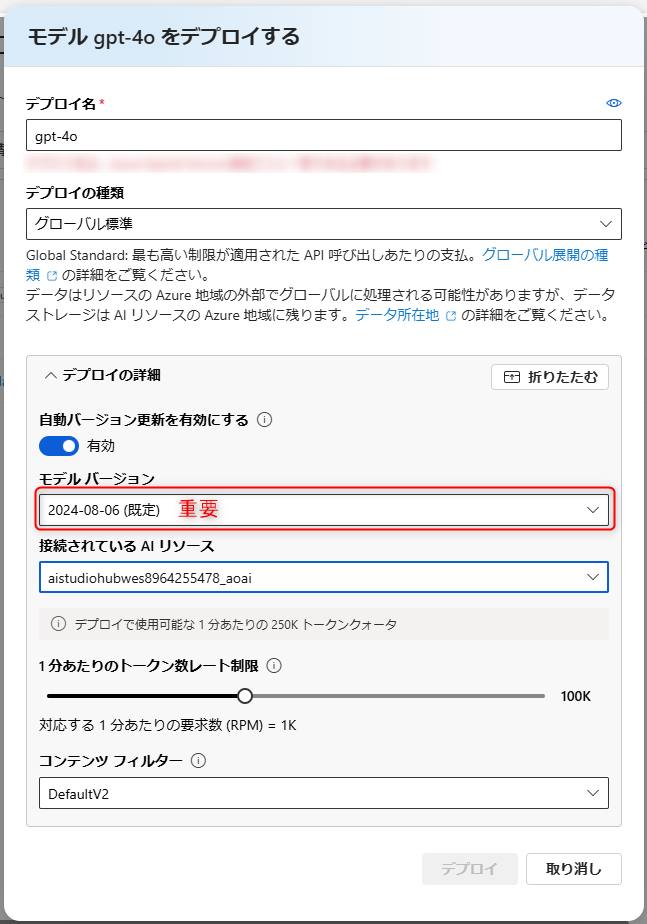

「デプロイ」ボタンをクリックするとすぐにデプロイされます。

1. デプロイが完了すると、完了画面が表示されます。ここで、Azure OpenAI のエンドポイントとキーをメモしておきます。
下記の画像の、ターゲットURIの `https://<hub リソース名>.openai.azure.com` の部分がエンドポイントです。（`openai.azure.com` 以降のURLは不要です）キーも同様にコピーします。

    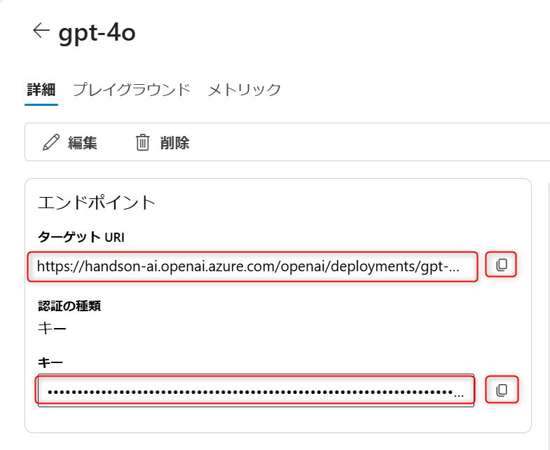

1. コピーした内容は下記のようにメモ帳にメモしておきます。もしくは`.env`ファイルに追加しても構いません。デプロイ名はデフォルト値の場合 `gpt-4.1-mini`です。
    ```
    AZURE_OPENAI_ENDPOINT ="コピーしたエンドポイント"
    AZURE_OPENAI_KEY ="コピーしたキー"

    ```

### Azure OpenAI Service の作成と Embedding モデルのデプロイ

>**※注意**\
>この手順は演習1で、 Azure AI Search の **データのインポートとベクター化** 機能を用いる際に Azure OpenAI Service リソースの embedding モデルが必要となるため行います。一つ前の手順でデプロイした Azure AI Foundry リソース作成時につくられる Azure AI Services とは**別で**、Azure OpenAI リソースを作成します。


1. [Azure portal](https://portal.azure.com/) にアクセスして「リソースの作成」をクリックします。\
  

1. 上部のテキストボックスに「Azure OpenAI」と入力して検索し、作成をクリックします。

1. 設定項目を下記のようにしてください。

    | 項目 | 値 |
    | --- | --- |
    |リソースグループ|今回作成したリソースグループを選択|
    |リージョン| West US|
    |名前| 任意 |
    |価格レベル| Standard S0|

    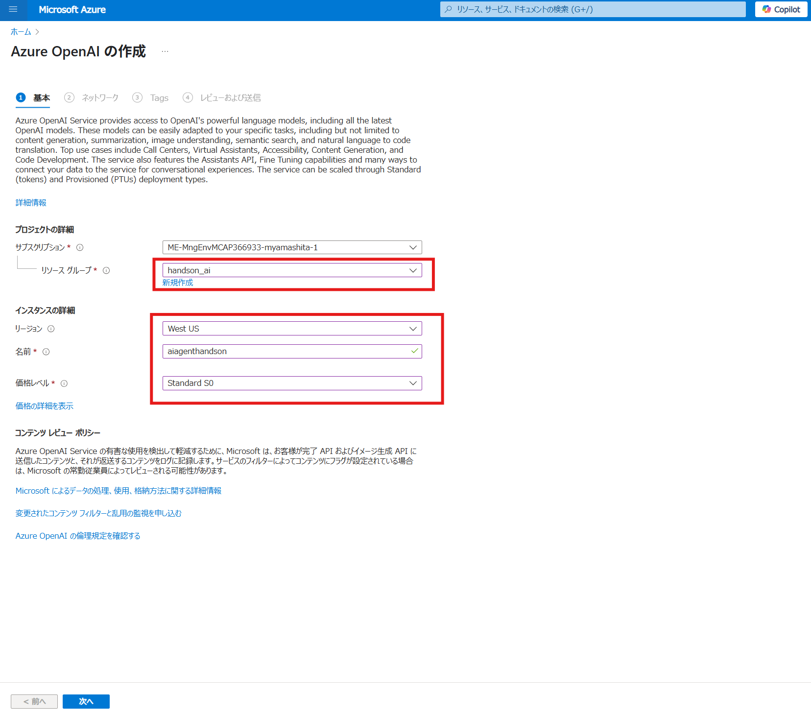

1. 入力を追えたら、[次へ]を選択し、その他の設定はデフォルト値のまま進めます。
  [レビューおよび送信]タブで、確認をしたら[作成]を選択します。\
  Azure OpenAI リソースがデプロイされるのを待ちます。

1. デプロイ後、[リソースに移動]を新たに作成された Azure OpenAI Service を展開します。[Launch Azure AI Foundry Portal]を選択します。\
  ※左上に **Azure AI Foundry | Azure OpenAI Service**とあり、こちらは project とは別の画面です。

1. 左側の[共有リソース]の[デプロイ]を選択します。
    
1. 左のメニューの下部にある「マイアセット」内の「モデル＋エンドポイント」を選択して「モデルのデプロイ」を選択し、「基本モデルをデプロイする」をクリックします。

1. `text-embedding-ada-002` のモデルを選択します。以下のようにモデルを選択し「確認」ボタンをクリックします。
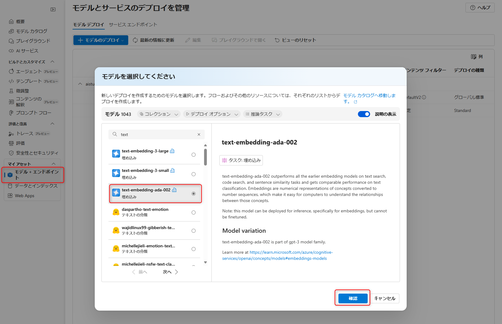

1.  デプロイ設定は、デフォルト値のままで構いません。デプロイの種類は「グローバル標準」に設定します。
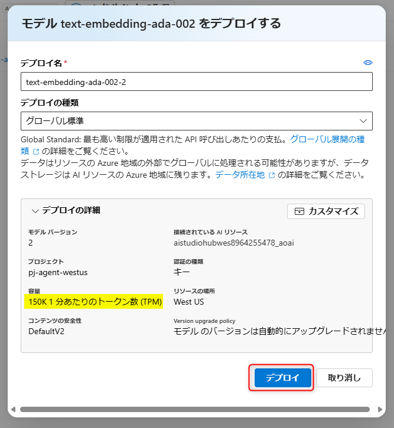

「デプロイ」ボタンをクリックするとすぐにデプロイされます。

演習0はこれで終了です。モデルを利用する準備ができました。\
次は Azure AI Agent Service についての座学を行ったのち、演習1でシングルエージェントを実装していきます。


<br>

## 次へ

👉 [**演習1：保険商品案内エージェントの作成**](ex1.md)

<br>

<hr>

🏚️ [README に戻る](../README.md)