# 演習 1 : 保険商品案内エージェントの作成

この演習 1 で実施するタスクは以下のとおりです。
- RAG 用インデックスの作成
- エージェントの作成
- インデックスをツールとして呼び出せるように登録
- Code Interpreter の登録
- Bing Search Grounding の登録
- エージェントからツールの呼び出し

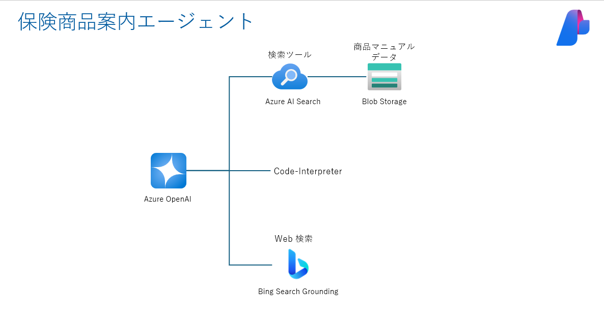


## 演習 1-1 保険商品に関するインデックスを作成する
この演習では、保険商品の情報を Azure AI Search で検索できるように、インデックスを作成します。

---
### 1. サンプルデータをダウンロード

以下のサンプルデータを使用します。ダウンロードしてください。：

📄 [sampledata/product_info.md](../sampledata/product_info.md)

---

### 2. サンプルデータを Azure Storage にアップロード
ここからはサンプルデータを Azure Storage にアップロードする手順を解説します。

手順：

1. Azure Portal を開いてください。
2. リソースグループを展開してください。
   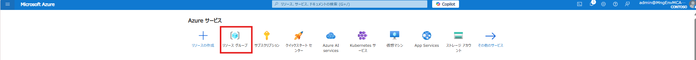
   
3. ex.0で Azure AI Foundry Hub を作成したリソースグループを選択してください。
4. Azure AI Foundry Hub を作成したときに一緒に作成された [Storage Account] を選択してください。
5. 左のタブの [データストレージ] を展開し、[コンテナー] を展開します。
   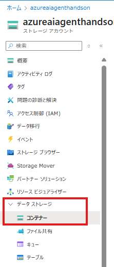
   
6. ＋コンテナ から `sampledata` という名前の Blob コンテナ を作成します。
7. コンテナーに戻り、 `sampledata` を展開してください。
   
   
8. アップロードから ファイルの参照を展開してください。
   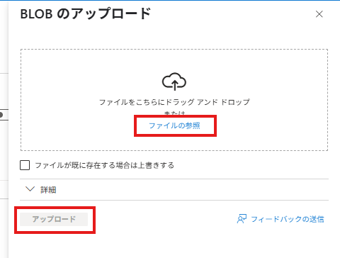
   
9. 事前にダウンロードした`product_info.md` をにアップロードする。

この手順でサンプルデータのアップロードを完了できます。

---

### 3. Azure AI Search の作成
Azure AI Search からストレージにアクセスするには、RBAC（ロールベースアクセス制御）の手動設定が必要です。
まずは以下の手順に従って、Azure AI Search の作成を行ってください：

1. Azure Portal を開き、 Azure AI Search をデプロイします。

   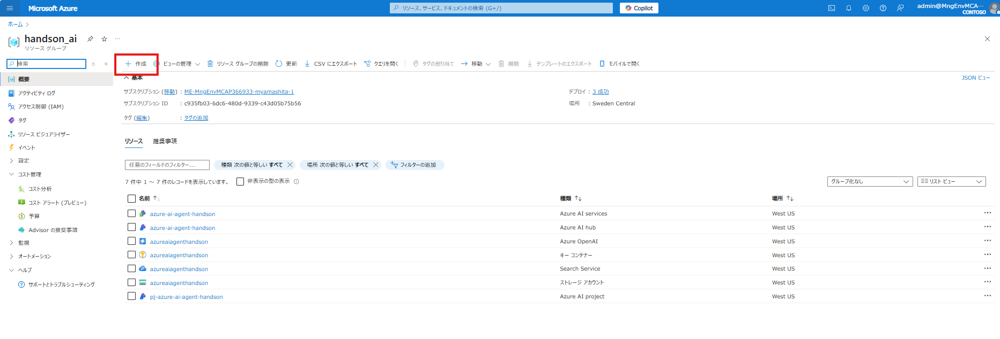
   
手順：
 - サービス名は任意の名前にしてください。
 - Azure AI Search の価格プランは **Basic** を利用してください。　※ベクトル検索を使用するため。
 - リージョンは **Azure AI Foundry Hub** と同一にしてください。

   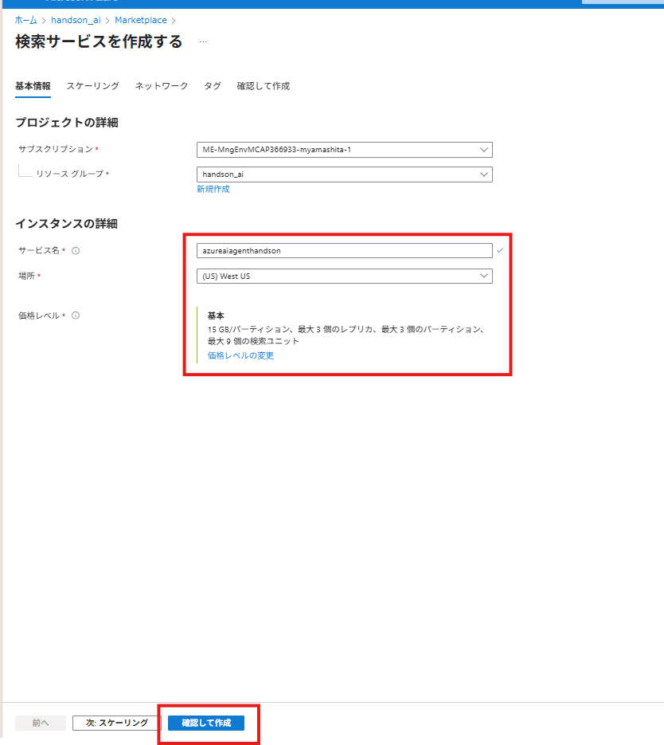
   
2. Azure AI Search のエンドポイントとキーをメモしてください。※envファイルにて使用します。

AI_SEARCH_ENDPOINT＝ <Azure AI Search のエンドポイント>

AI_SEARCH_KEY = <Azure AI Search のプライマリキー>

エンドポイントとキーの取得手順は以下を参照ください。

 手順：
 作成された Azure AI Search を展開してください。
 - エンドポイント：概要 の [URL] 
    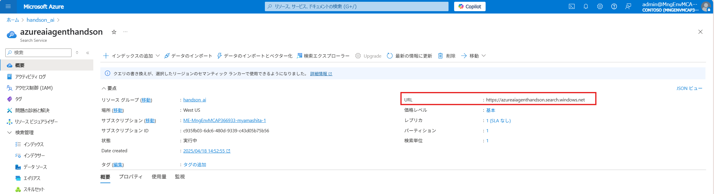
 - キー：[設定] を展開。[キー」から [プライマリ管理者キー] を選択。
    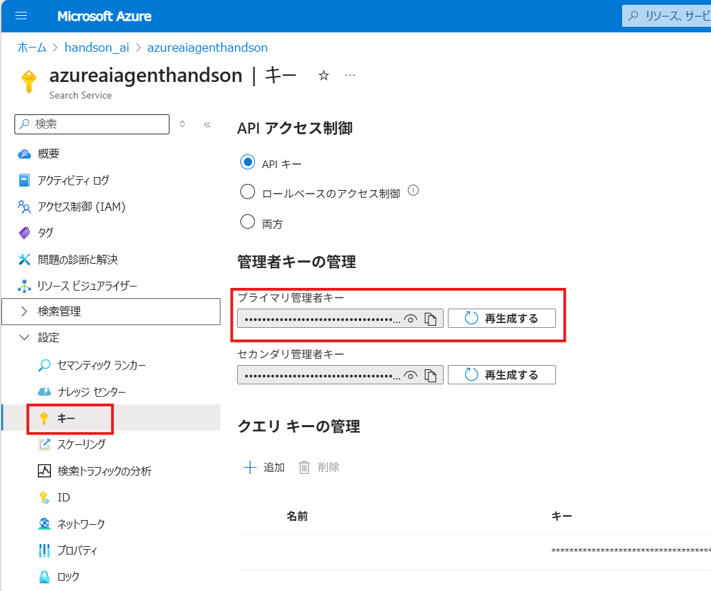
    
3. RBAC（ロールベースアクセス制御）の手動設定
ここからはAzure AI Search からストレージにアクセスするために必要になる RBAC（ロールベースアクセス制御）の手動設定 を行います。

対象：**Azure AI Foundry Hub と同時に作成された Storage Account**

設定手順：  
1. Azure Portal > ストレージアカウント > 「アクセス制御（IAM）」へ移動
2. 「ロールの割り当て」から「Storage Blob データ閲覧者」を選択

   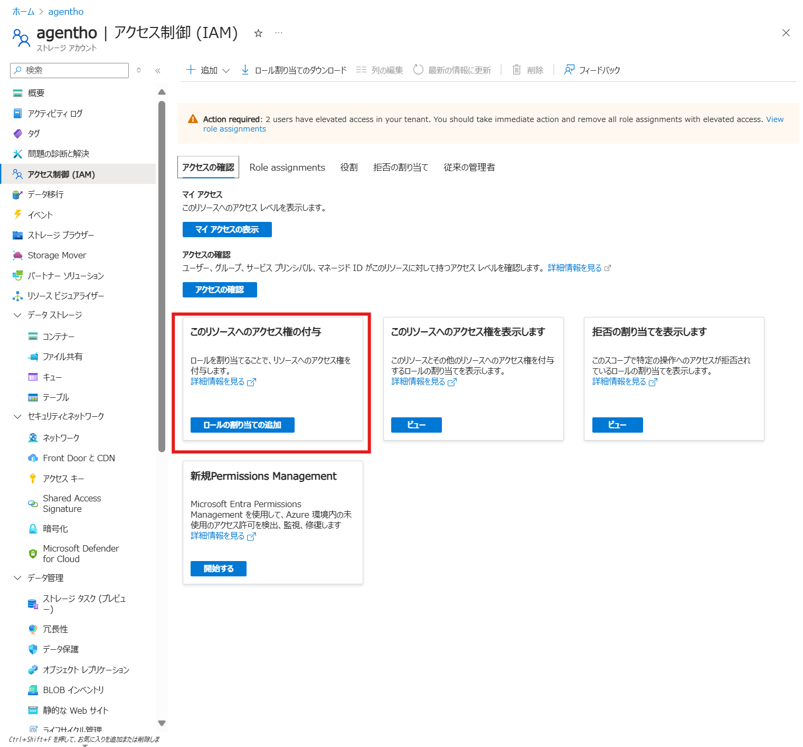
   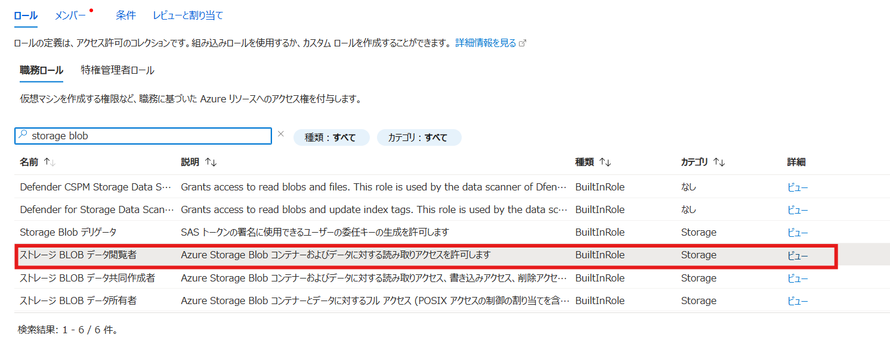
   
3. 検索フィルタから Azure AI Search の マネージドID を選択
4. 「マネージド ID」リストから、Azure AI Search のリソース名（例：aisearch-xxx）を検索して選択

   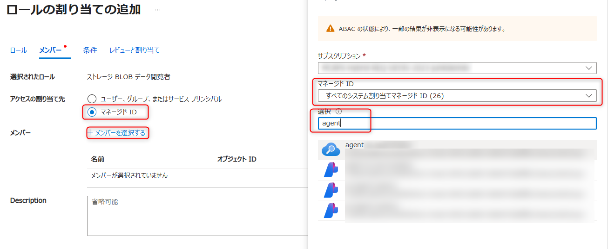
   
5. すべての設定を確認した後、「**レビューと割り当て**」をクリックして、設定を完了。

これで、Azure AI Search がストレージアカウントにアクセスできるようになります。
この設定により、検索インデックス作成時に必要なストレージデータにアクセス可能となり、エージェントや他のアプリケーションから適切にデータを操作できます。 


### 4. Azure AI Search でインデックスを作成

ここからは Azure AI Search でインデックスを作成する方法を解説します。

手順：
1. Azure Portal を開く。
2. リソースグループを展開。

   
   
3.「データのインポートとベクター化」を選択
   Azure AI Search のリソースに移動し、上部にあるデータのインポートとベクター化を選択してください。
   
   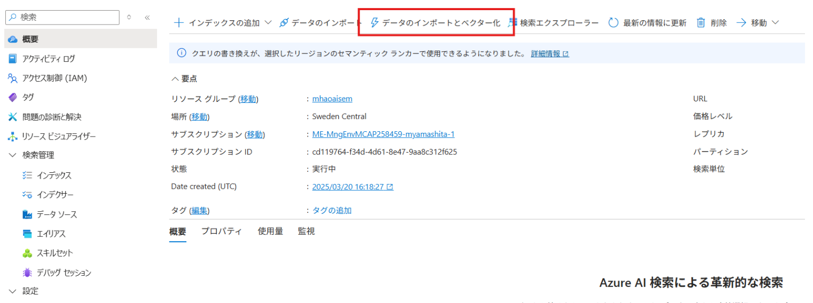
   
4. データソースで「Azure Blob Storage」を選択

5. 「Azure Blob Storage」の構成画面の入力は以下を参考にしてください。入力後、次へを選択してください。


- ストレージアカウント：本演習の1-1-2で利用した ストレージ を選択
- BLOBコンテナー：sampledata を選択
- 解析モード：Markdown を選択

   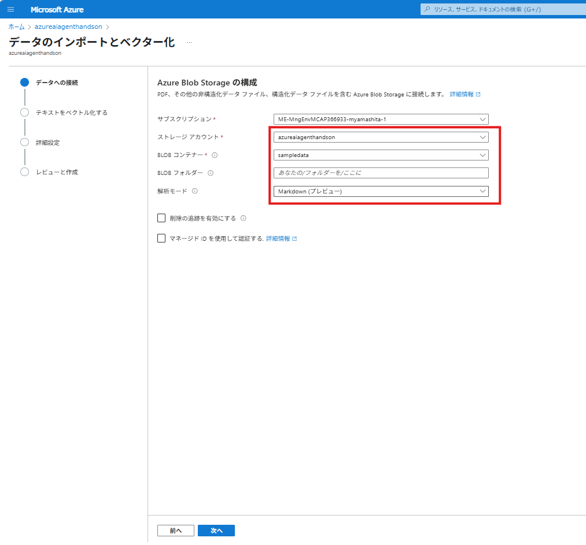

6. 「テキストをベクトル化する」の手順に移り、以下の設定を行った後「次へ」を選択してください。

手順：
- Kind：Azure OpenAI を選択
 - サブスクリプション：本ハンズオンで使用しているサブスクリプションを選択
 - Azure OpenAI Service：ex0で作成したリソースを使用
 - モデルデプロイ：ex0で作成した text-embedding-ada-002 を使用
 - 認証の種類：APIキー
 - Azure OpenAI Serviceに接続すると、アカウントに追加料金が発生することを承認します。 をチェックする。

   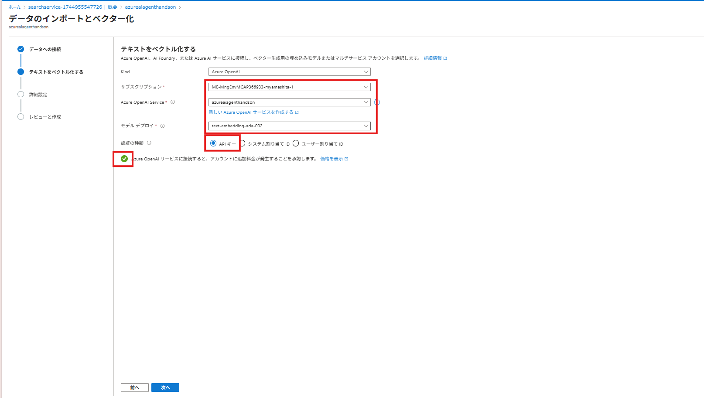
   
7. セマンティックランカーは有効に設定。その他の設定は、既存のまま「次へ」を選択してください

   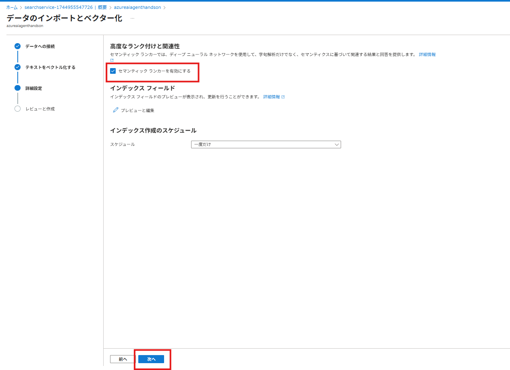
   

8. 「レビューと作成」画面で、「作成」を選択すれば、完了です。

   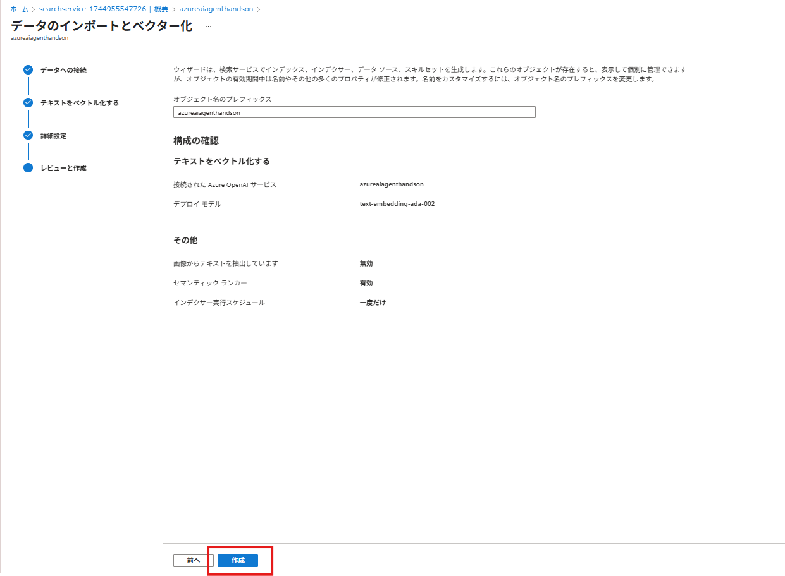

## 演習 1-2 Grounding with Bing Search の作成  

### Grounding with Bing Search の作成

ここからは、「Grounding with Bing Search」リソースの新規作成を行います。
1. Azure Portal からこれまで使用していたリソースグループを選択してください。
2. 「作成」からジェントや他のアプリケーションから適切にデータを操作できます。 


### 4. Azure AI Search でインデックスを作成

ここからは Azure AI Search でインデックスを作成する方法を解説します。

手順：
1. Azure Portal を開く。
2. リソースグループを展開。

   
   
3.「データのインポートとベクター化」を選択
   Azure AI Search のリソースに移動し、上部にあるデータのインポートとベクター化を選択してください。
   
   
   
4. データソースで「Azure Blob Storage」を選択

5. 「Azure Blob Storage」の構成画面の入力は以下を参考にしてください。入力後、次へを選択してください。

手順
- ストレージアカウント：本演習の1-1-2で利用した ストレージ を選択
- BLOBコンテナー：sampledata を選択
- 解析モード：Markdown を選択

   

6. 「テキストをベクトル化する」の手順に移り、以下の設定を行った後「次へ」を選択してください。

手順
- Kind：Azure OpenAI を選択
- サブスクリプション：本ハンズオンで使用しているサブスクリプションを選択
- Azure OpenAI Service：ex0で作成したリソースを使用
- モデルデプロイ：ex0で作成した text-embedding-ada-002 を使用
- 認証の種類：APIキー
- Azure OpenAI Serviceに接続すると、アカウントに追加料金が発生することを承認します。 をチェックする。

   
   
7. セマンティックランカーは有効に設定。その他の設定は、既存のまま「次へ」を選択してください

   
   

8. 「レビューと作成」画面で、「作成」を選択すれば、完了です。
   
   
9. Azure AI Search のインデックス名をメモしてください。※envファイルにて使用します。

INDEX_NAME = <インデックス名>

手順
- Azure AI Searc のリソースから [検索管理] → [インデックス] を選択します。
- 今回作成したインデックスの名前を取得できます。
   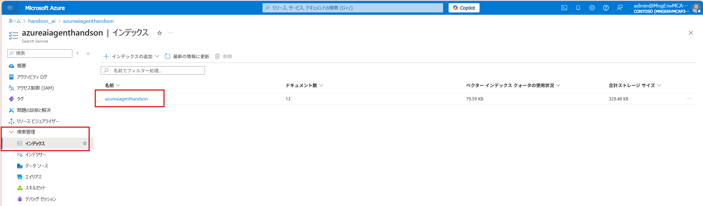


## 演習 1-2 Grounding with Bing Search の作成  

### Grounding with Bing Search の作成
1. Azure Portal を開き、[リソースグループ] を展開。ここまで使用している該当のリソースグループを選択してください。
 
   
2. 「作成」から `Grounding with Bing Search` をデプロイしてください。
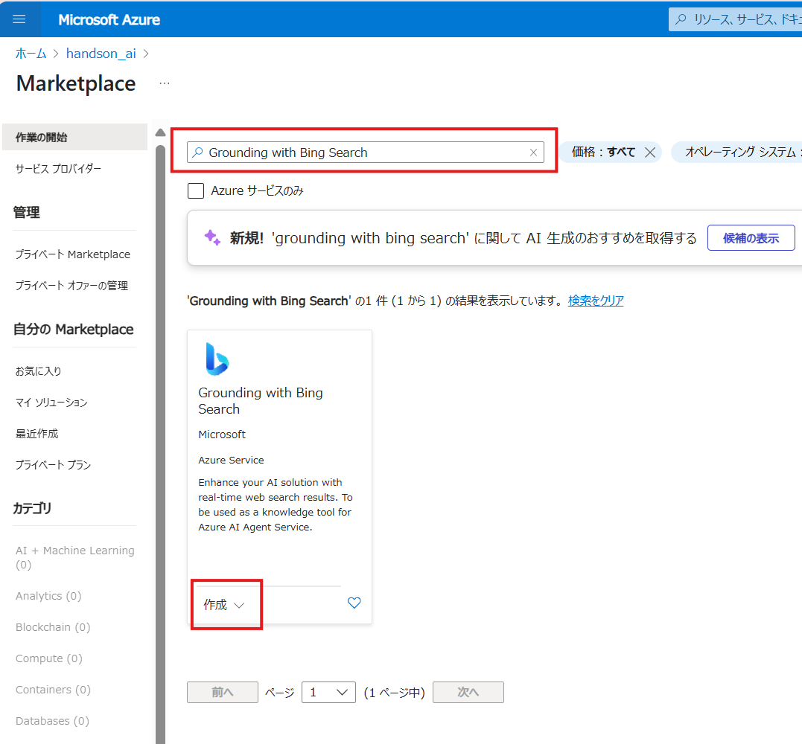

手順：
- 名前：任意の名前を設定してください
- 価格レベル：Grounding with Bing Search ($35 per 1K transactions) を選択
- ご契約条件を参照いただき、[上記通知を読み、理解しました。]にチェックを入れる

3. 「確認と作成」でデプロイ完了
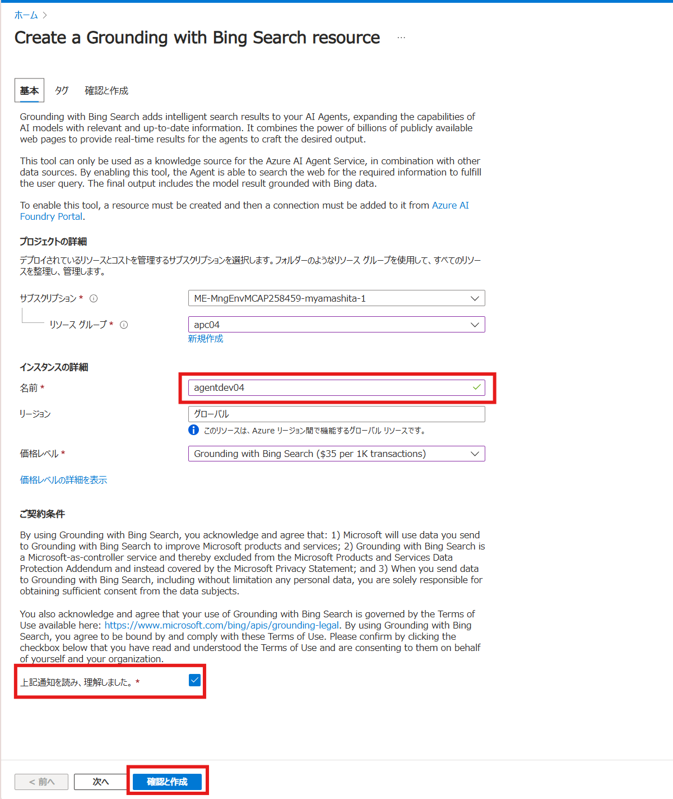

上記手順で Grounding with Bing Search の作成は完了です。

### プロジェクトに接続
1. Azure Portal を開き、[リソースグループ] を展開。ここまで使用している該当のリソースグループを選択してください。
 
 
2. リソースの一覧から ex.0 で作成した Azure AI Projectを選択。
 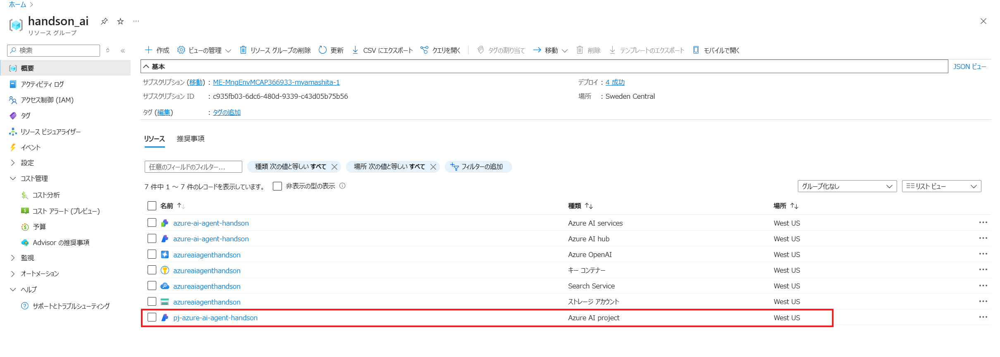

4. その後、[Launch Studio] からAzure Ai Foundryを起動。
 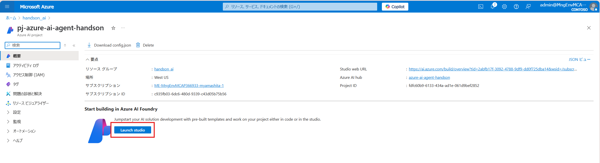
 
5. 起動後、画面の右下にある [管理センター] を選択。
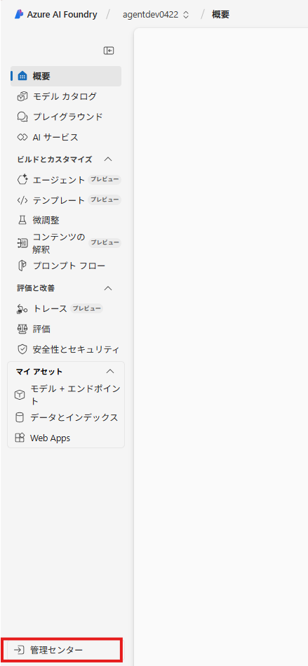

6. 「新しい接続」を選択し、「Bing検索を使用したグラウンド」を追加。
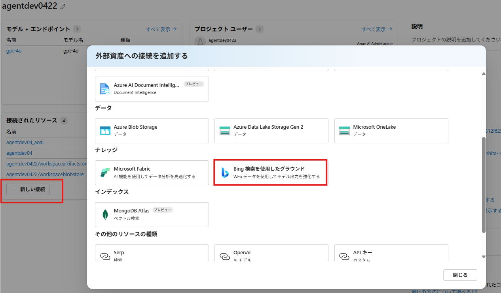
7. 管理画面に戻り、接続名を確認する。この追加方法の場合、既定でリソース名が接続名となります。
BING_CONNECTION_NAME= <Bing 接続名> のようにメモをしてください。
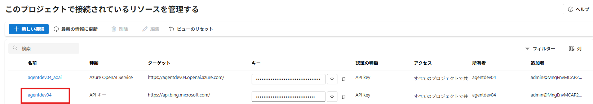

 
## 演習1-3  動作確認

### .env ファイルの設定

以下のように `.env` ファイルの環境変数に接続名をこれまでのメモを活用しながら、指定してください。

📄 [.env-sample](../.env-sample)


```python
PROJECT_CONNECTION_STRING = <プロジェクトの接続文字列>
AI_SEARCH_ENDPOINT＝ <Azure AI Search のエンドポイント>
AI_SEARCH_KEY = <Azure AI Search のプライマリキー>
INDEX_NAME = <インデックス名>
BING_CONNECTION_NAME= <Bing 接続名> #(例 agentdev04) 
```

エージェントの作成からツールセットの登録、スレッドの実行までの手順は以下のノートブックから行ってください。

📄[product_search_agent.ipynb](../single-agent/product_search_agent.ipynb)


<br>

## 次へ

👉 [**演習2 : 契約管理エージェントの作成**](ex2.md) 

<br>

<hr>

🏚️ [README に戻る](README.md)
