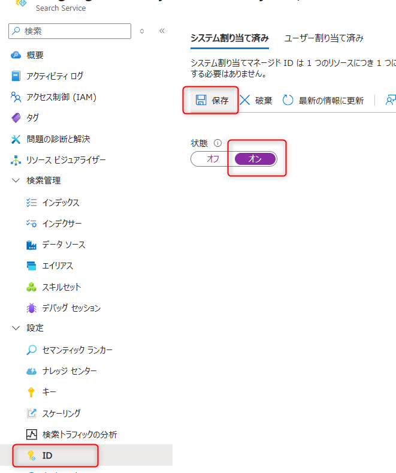
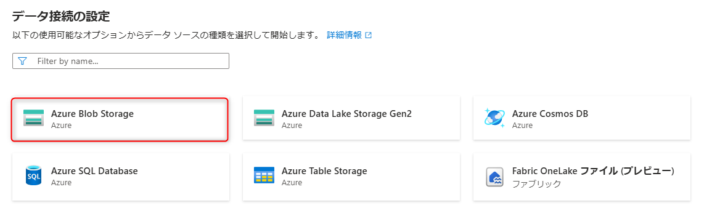
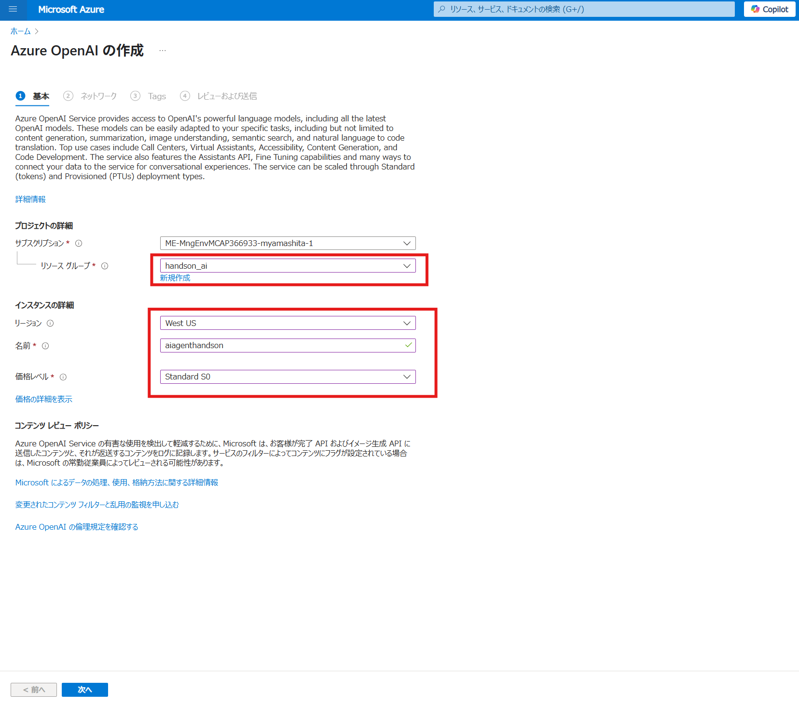
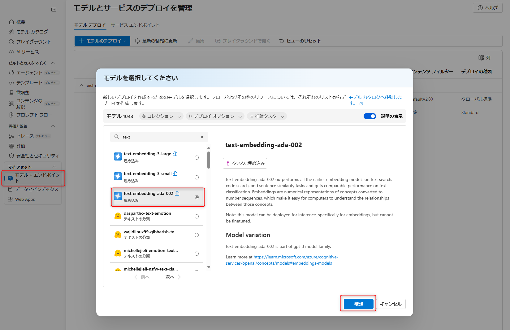
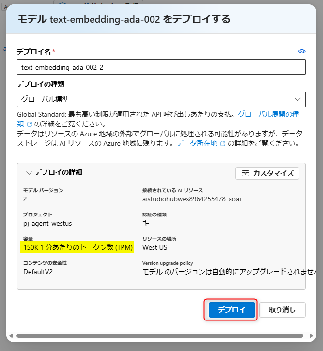
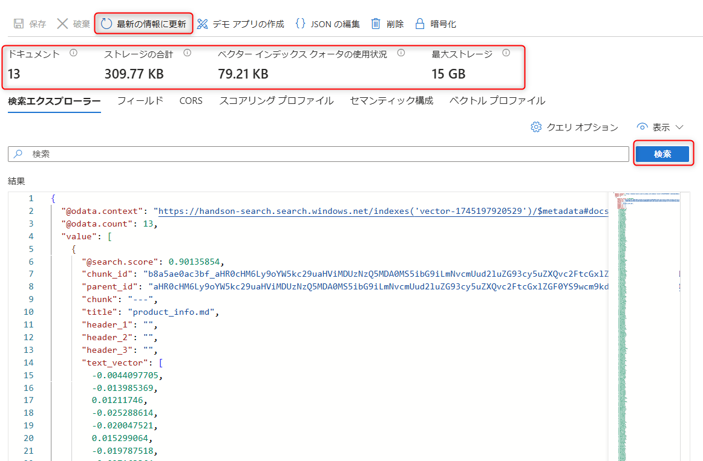
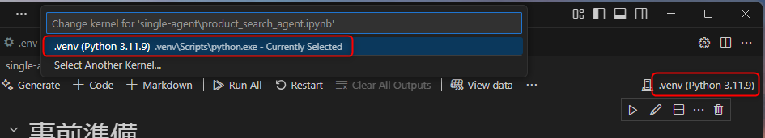

# 演習 1 : 保険商品案内エージェントの作成

この演習 1 で実施するタスクは以下のとおりです。
- RAG 用インデックスの作成
- エージェントの作成
- インデックスをツールとして呼び出せるように登録
- Code Interpreter の登録
- Bing Search Grounding の登録
- エージェントからツールの呼び出し


## 演習 1-1 保険商品に関するインデックスを作成する
この演習では、保険商品の情報を Azure AI Search で検索できるように、インデックスを作成します。

---
### 1. サンプルデータの確認

以下のサンプルデータを使用します。
sampledata ディレクトリにあるマークダウンを用います。

📄 [sampledata/product_info.md](../sampledata/product_info.md)

---

### 2. サンプルデータを Azure Storage にアップロード
ここからはサンプルデータを Azure Storage にアップロードする手順を解説します。

手順：

1. Azure Portal を開きます。
2. リソースグループを展開してください。
   
   
3. 演習0で新規作成したリソースグループを選択してください。
4. Azure AI Foundry Hub を作成したときに一緒に作成された [Storage Account] を選択してください。
5. 左のタブの [データストレージ] を展開し、[コンテナー] を展開します。

   
   
6. 上部にある[＋コンテナ] をクリックすると、右側のパネルで設定画面がでるので、コンテナの名前を `sampledata` とし、[作成]を押下します。

7. 作成した `sampledata` のコンテナを展開してください。

   
   
8. 上部にある[アップロード]から ファイルの参照を選択し、ローカルの `sampledata/product_info.md`をアップロードしてください。

   
   

この手順でサンプルデータのアップロードを完了できます。

---

### 3. Azure AI Search の作成
まずは以下の手順に従って、Azure AI Search の作成を行ってください：

1. Azure Portal > 今回作成したリソースグループ を開き、画面上部の[+作成]から、Azure AI Search を検索し、[作成]を押下します。

   
   
   設定項目：
   - サービス名は任意の名前にしてください。
   - Azure AI Search の価格プランは **Basic** を利用してください。\
   ※ベクトル検索を使用するため。
   - リージョンは **Azure AI Foundry Hub** と同一の **West US**　にしてください。

   
   
2. Azure AI Search のエンドポイントとキーをメモしてください。`.env`ファイルに直接追記してもOKです。\
   ```
   AI_SEARCH_ENDPOINT="Azure AI Search のエンドポイント"
   AI_SEARCH_KEY="Azure AI Search のプライマリキー"
   ```

   エンドポイントとキーの確認方法は、以下を参照ください。
   確認方法：作成された Azure AI Search を展開してください。
   
   - エンドポイント：概要 の [URL] 
      

   - キー：[設定] を展開。[キー]から [プライマリ管理者キー] を選択。
      
    
### 4. RBAC（ロールベースアクセス制御）の手動設定

ここからはAzure AI Search からストレージにアクセスするために必要になる RBAC（ロールベースアクセス制御）の手動設定 を行います。

設定手順： 
1. Azure Portal >　[今回のハンズオンで作成したリソースグループ] >　[Azure AI Search リソース] > 左のタブの設定項目内の[「ID」]に移動

2. [システム割り当て済み]タブの、状態を[オン]にし、上部の[保存]をクリック\
確認のポップアップが出た場合は、[はい]を選択してください。

   

3. Azure Portal >　[今回のハンズオンで作成したリソースグループ] > [ストレージアカウント] > [アクセス制御（IAM）]へ移動
4. [このリソースへのアクセス権の付与]パネルにある[ロールの割り当ての追加]を選択

   

5. 職務ロールの検索ボックスに[「ストレージ Blob データ閲覧者」]を入れて、選択したうえで、[次へ]を押下

   
   
6. [アクセスの割り当て先]を[マネージドID]にチェックし、その下の[＋メンバーを選択する]を押下

7. 右側のパネルの[「マネージド ID」]リストで[すべてのシステム割り当てマネージドID]を選び、[選択]の欄では[Azure AI Search のリソース名]を検索して選択し、下部の[選択]を押下

   

8. すべての設定を確認した後、[レビューと割り当て]をクリックして、問題なければ再度[レビューと割り当て]設定を完了。

   これで、Azure AI Search がストレージアカウントにアクセスできるようになります。


### 5. Azure AI Search でインデックスを作成

ここからは Azure AI Search でインデックスを作成する方法を解説します。

1. Azure Portal > 今回作成したリソースグループ > Azure AI Search に移動
   
2. 「データのインポートとベクター化」を選択
   Azure AI Search のリソースに移動し、上部にあるデータのインポートとベクター化を選択してください。\
   
   
3. データソースで「Azure Blob Storage」を選択
   

5. 「Azure Blob Storage」の構成画面の入力は以下を参考にしてください。入力後、次へを選択してください。

   > - ストレージアカウント：本演習の1-1-2で利用した ストレージ を選択
   > - BLOBコンテナー：sampledata を選択
   > - 解析モード：Markdown を選択 

    

6. 「テキストをベクトル化する」の手順に移り、以下の設定を行った後「次へ」を選択してください。

   設定項目：
   - Kind：Azure OpenAI を選択
   - サブスクリプション：本ハンズオンで使用しているサブスクリプションを選択
   - Azure OpenAI Service：[新しい Azure OpenAI サービスを作成する] を選択

      

      1. 遷移した画面で、次のように入力します。Azure AI Seach のインデックス作成画面は閉じずに**開いたままにしてください**。
      
      | 項目 | 値 |
      | --- | --- |
      |リソースグループ|今回作成したリソースグループを選択|
      |リージョン| West US|
      |名前| 任意 |
      |価格レベル| Standard S0|

      1. 入力を追えたら、[次へ]を選択し、その他の設定はデフォルト値のまま進めます。
      [レビューおよび送信]タブで、確認をしたら[作成]を選択します。\
      Azure OpenAI リソースがデプロイされるのを待ちます。

      1. デプロイ後、リソースグループに移動すると、新たに作成された Azure OpenAI Service を展開します。[Explore Azure AI Foundry Portal]を選択すると、次のような画面になります。\
       左上に **Azure AI Foundry | Azure OpenAI Service**とあり、こちらは project とは別の画面です。

      1. 左側の[共有リソース]の[デプロイ]を選択します。
       
      1. 左のメニューの下部にある「マイアセット」内の「モデル＋エンドポイント」を選択して「モデルのデプロイ」を選択し、「基本モデルをデプロイする」をクリックします。

      1. `text-embedding-ada-002` のモデルを選択します。以下のようにモデルを選択し「確認」ボタンをクリックします。
      

      1.  デプロイ設定は、デフォルト値のままで構いません。デプロイの種類は「グローバル標準」に設定します。
      

      「デプロイ」ボタンをクリックするとすぐにデプロイされます。

      1.  Embedding モデルがデプロイできたので、Azure AI Search のインデックス作成画面に戻ります。

      1. Azure OpenAI Service 選択画面のリフレッシュボタンを押下し、最新情報を反映させると、この手順で作成した Azure Open AI Service が選択できるので、選択します。


   - モデルデプロイ： `text-embedding-ada-002` を選択
   - 認証の種類：APIキー
   - Azure OpenAI Serviceに接続すると、アカウントに追加料金が発生することを承認します。 をチェックする。

      
   
7. セマンティックランカーは有効に設定。その他の設定は、既存のまま「次へ」を選択してください

    
   

8. 「レビューと作成」画面で、[オブジェクト名のプレフィックス]を任意の名前にします。この名前はインデックス名となり、後続の手順で使うため、メモしておきます。「作成」を選択すれば、完了です。
      ```
      INDEX_NAME="オブジェクト名のプレフィックスで入力した名前"
      ```

   

9. 作成されたインデックスを確認します。Azure AI Search リソースの [検索管理]から[インデックス]を選択し、前の手順で指定したインデックス名を選択します。

10. 遷移した画面で、上部の[最新の情報に更新]を選択してリフレッシュしたあと、検索ボックスに何も入れない状態で[検索]をクリックしてください。アップロードしたマークダウンファイルが自動でチャンキングされ、ベクターインデックスと共に作成されていることが確認できます。

      

ここまでの手順で、Azure AI Search で検索を行うための準備が完了しました。

## 演習 1-2 Grounding with Bing Search の作成  
演習 1-2 では Grounding with Bing Search リソースを作成し、エージェントが Webからの情報を元に回答できるようにします。

### Grounding with Bing Search の作成
1. Azure Portal を開き、[リソースグループ] を展開。ここまで使用している該当のリソースグループを選択してください。
 
   
2. 「作成」から `Grounding with Bing Search` 検索し、「作成」を選択してください。


   設定：
   - 名前：任意の名前を設定してください
   - 価格レベル：Grounding with Bing Search ($35 per 1K transactions) を選択
   - ご契約条件を参照いただき、[上記通知を読み、理解しました。]にチェックを入れる

3. 「確認と作成」を押下し、問題無ければ[作成]を選択してデプロイします。


   上記手順で Grounding with Bing Search の作成は完了です。

### プロジェクトに接続
1. Azure Portal を開き、[リソースグループ] を展開。ここまで使用している該当のリソースグループを選択してください。
 
 
2. リソースの一覧から演習0で作成した Azure AI Project を選択。
 

4. その後、[Launch Studio] からAzure AI Foundryを起動。
 
 
5. 起動後、画面の右下にある [管理センター] を選択\
   

6. 「新しい接続」を選択し、「Bing検索を使用したグラウンド」を選択。Grounding with Bing Search リソースの一覧が表示されるため、今回作成したリソースを選択し「接続」を押下
   

7. 管理画面に戻り、接続名を確認します。この接続名もメモをするか、`.env`ファイルに追記してください。 \
   ```
   BING_CONNECTION_NAME= "Bing 接続名"
   ```
   のようにメモをしてください。
   

 
## 演習1-3  動作確認

### .env ファイルの設定

以下のように `.env` ファイルの環境変数に接続名をこれまでのメモを活用しながら、追加してください。

📄 [.env-sample](../.env-sample)

```python
PROJECT_CONNECTION_STRING = <プロジェクトの接続文字列>
AI_SEARCH_ENDPOINT＝ <Azure AI Search のエンドポイント>
AI_SEARCH_KEY = <Azure AI Search のプライマリキー>
INDEX_NAME = <インデックス名>
BING_CONNECTION_NAME= <Bing 接続名> #(例 agentdev04) 
```

ここまででリソースの準備ができました。

### シングルエージェントの動作確認
次にエージェントの作成からツールセットの登録、スレッドの実行までを行います。
お手元の Visual Studio Code に戻り、`single-agent/product_search_agent.ipynb`を開きます。
右上のカーネルの選択画面で、 `.venv` を選択します。


手順は以下のノートブックから行ってください。

📄[product_search_agent.ipynb](../single-agent/product_search_agent.ipynb)


<br>

## 次へ

👉 [**演習2 : 契約管理エージェントの作成**](ex2.md) 

<br>

<hr>

🏚️ [README に戻る](README.md)
