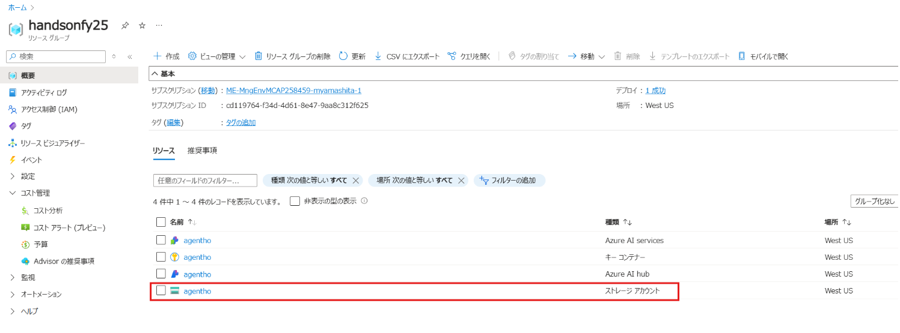
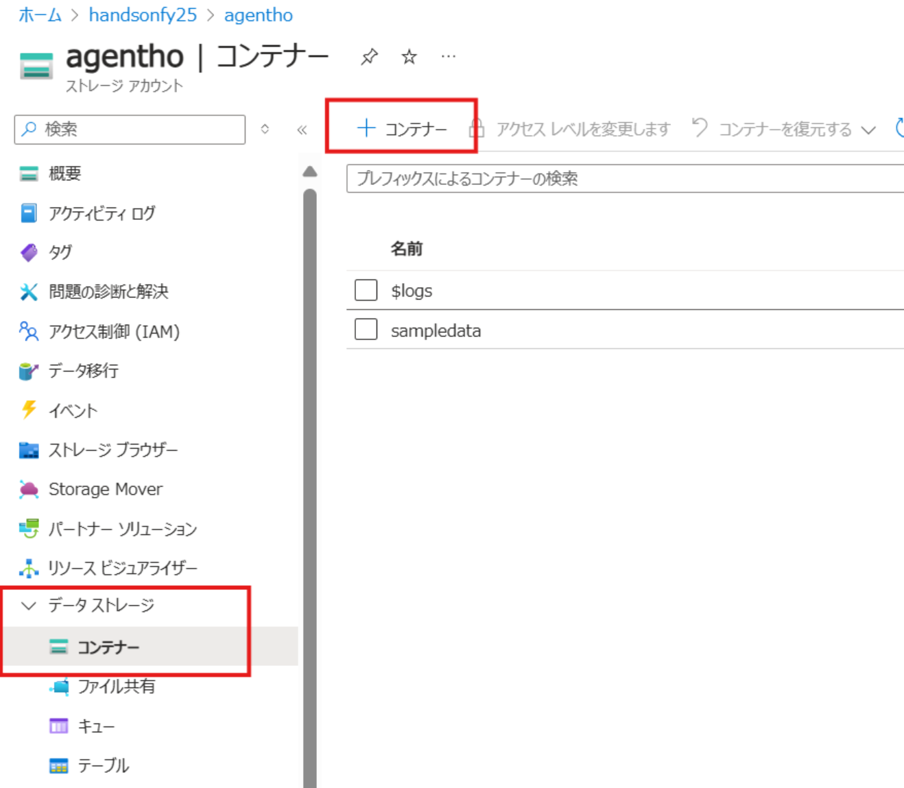
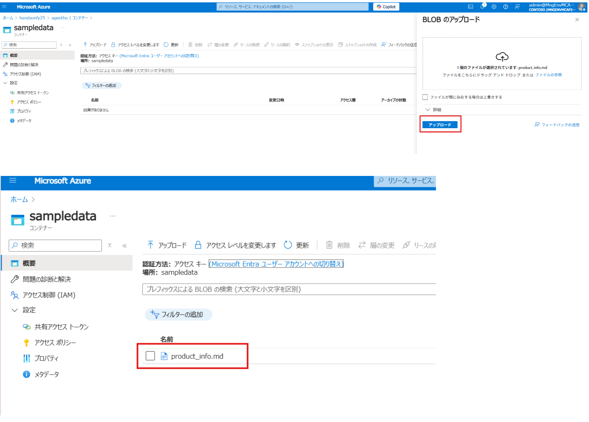
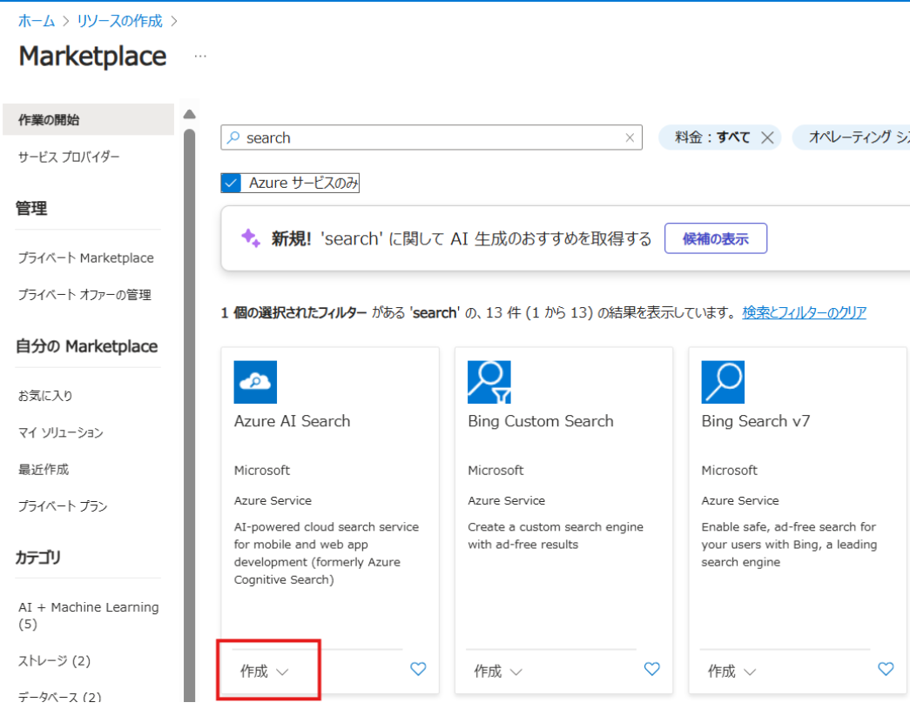
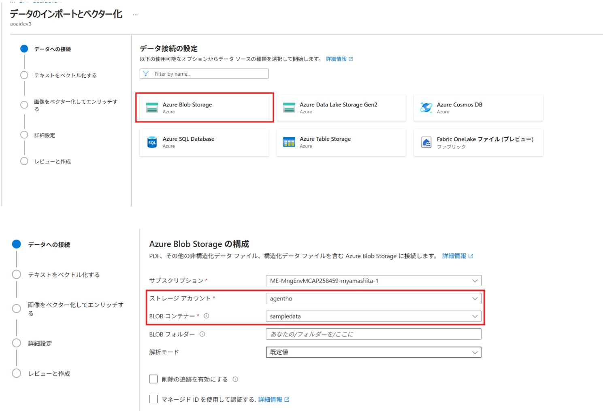
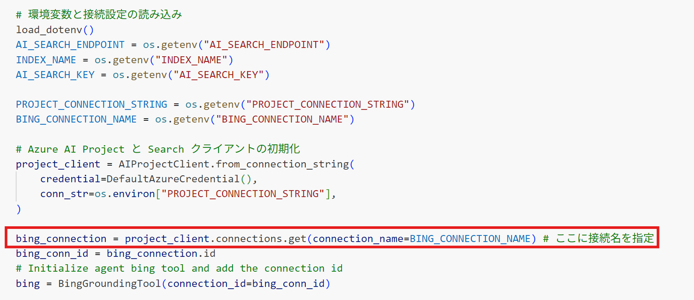
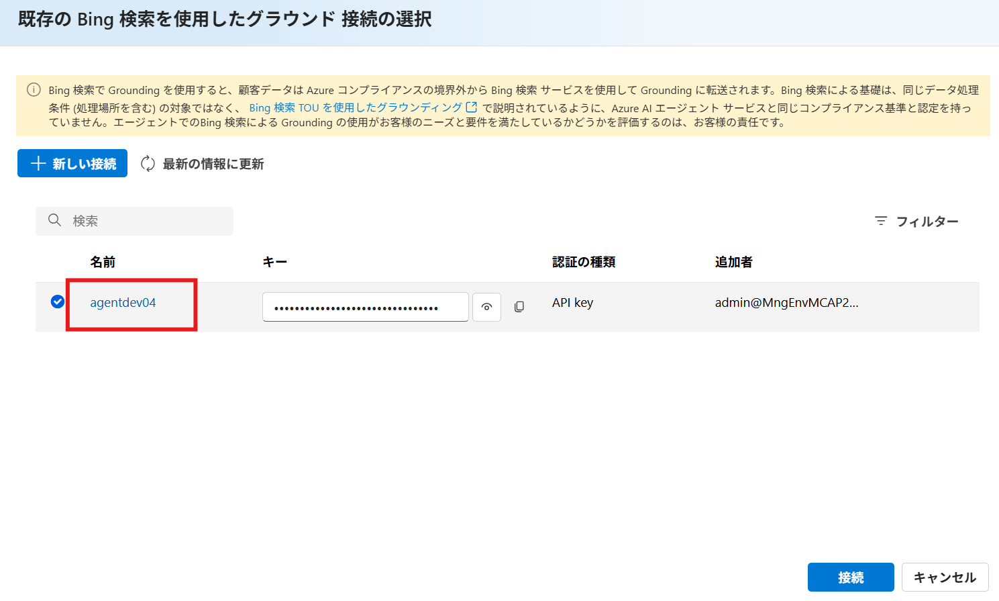

# 演習 1 : 保険商品案内エージェントの作成

この演習 1 で実施するタスクは以下のとおりです。
- RAG 用インデックスの作成
- エージェントの作成
- インデックスをツールとして呼び出せるように登録
- Code Interpreter の登録
- Bing Search Grounding の登録
- エージェントからツールの呼び出し

## 演習 1-1 保険商品に関するインデックスを作成する
この演習では、保険商品の情報を Azure AI Search で検索できるように、インデックスを作成します。

---
### 1. サンプルデータをダウンロード

以下のサンプルデータを使用します。ダウンロードしてください。：

📄 [sampledata/product_info.md](../sampledata/product_info.md)

---

### 2. サンプルデータを Azure Storage にアップロード

手順：

1. Azure Portal にログイン。
2. Azure AI Foundry Hub を作成したときに一緒に作成された Storage Account を開く  
   
3. `sampledata` という名前の Blob コンテナ を作成
   
4. `product_info.md` をそのコンテナにアップロードする
   

---

### 3. Azure AI Search でインデックスを作成

Azure AI Search のポータルで以下の手順に従ってインデックスを作成します：

1. Azure AI Search をデプロイする
   
> **注意事項：**  
> - Azure AI Search の価格プランは **Free** を利用可能  
> - リージョンは **Azure AI Foundry Hub** と同一にしてください

2. 「データのインポートとベクター化」を選択  
   
3. データソースで「Azure Blob Storage」を選択  
4. 先ほどアップロードした `product_info.md` を格納したストレージとコンテナを指定  
   

---

### 4. RBAC（ロールベースアクセス制御）の手動設定

Azure AI Search からストレージにアクセスするには、以下の設定が必要です：

対象：**Azure AI Foundry Hub と同時に作成された Storage Account**
設定手順：  
1. Azure Portal > ストレージアカウント > 「アクセス制御（IAM）」へ移動
2. 「ロールの割り当て」から「Storage Blob データ閲覧者」を選択
3. 検索フィルタから Azure AI Search の **マネージドID** を選択し、割り当て  

---

## 演習 1-2 エージェントの作成からツールセットの登録、スレッドの実行までの手順

このインデックス作成が完了したら、次の演習では AI Agent からこのデータを検索する処理を実装していきます。

### 1. セットアップ手順
1. VS Code 上で `single agents` フォルダを作成。
2. 下記のノートブックファイル（`product_search_agent.ipynb`）をそのフォルダ内に配置。

📄 [`single-agent/product_search_agent.ipynb`](./single-agent/product_search_agent.ipynb)

### 2.  補足：関数の定義
Bing Search の接続について
このノートブックでは、Azure AI Agent に Bing 検索を統合するために、事前に Azure AI Foundry 上で作成した Bing の接続名を指定する必要があります。

  
設定手順：  
1. Grounding with Bing Search のデプロイ
    
2. 該当のエージェントプレイグラウンドのナレッジにBing Searchを追加
3. その際の名前部分が接続名となります
  　

  
### 3.  動作の確認
- ターミナルからの実行
- エージェントプレイグラウンドでの確認

 

## 次へ

👉 [**演習2 : 契約管理エージェントの作成**](ex2.md) 

 

🏚️ [README に戻る](README.md)
