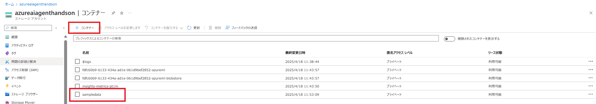

# 演習 1 : 保険商品案内エージェントの作成

この演習 1 で実施するタスクは以下のとおりです。
- RAG 用インデックスの作成
- エージェントの作成
- インデックスをツールとして呼び出せるように登録
- Code Interpreter の登録
- Bing Search Grounding の登録
- エージェントからツールの呼び出し


## 演習 1-1 保険商品に関するインデックスを作成する
この演習では、保険商品の情報を Azure AI Search で検索できるように、インデックスを作成します。

---
### 1. サンプルデータをダウンロード

以下のサンプルデータを使用します。ダウンロードしてください。：

📄 [sampledata/product_info.md](../sampledata/product_info.md)

---

### 2. サンプルデータを Azure Storage にアップロード

手順：

1. Azure Portal を開く。
2. リソースグループを展開。
   
   
3. ex.0で Azure AI Foundry Hub を作成したリソースグループを開く。
4. Azure AI Foundry Hub を作成したときに一緒に作成された Storage Account を開く。
5. 左のタブの データストレージ を展開し、コンテナー を展開する。
   
   
6. ＋コンテナ から `sampledata` という名前の Blob コンテナ を作成。
7. コンテナーに戻り、 `sampledata` を展開する。
   
   
8. アップロードから ファイルの参照を展開。
   
   
9. 事前にダウンロードした`product_info.md` をにアップロードする。

この手順でサンプルデータのアップロードを完了できます。

---

### 3.  RBAC（ロールベースアクセス制御）の手動
Azure AI Search からストレージにアクセスするには、RBAC（ロールベースアクセス制御）の手動設定が必要です。
以下の手順に従って、行ってください：

1. Azure Portal を開き、 Azure AI Search をデプロイする。

   
   
> **手順**
> - サービス名は任意の名前にしてください
> - Azure AI Search の価格プランは **Basic** を利用してください　※ベクトル検索を使用するため。
> - リージョンは **Azure AI Foundry Hub** と同一にしてください

   
   
2. RBAC（ロールベースアクセス制御）の手動設定

Azure AI Search からストレージにアクセスするには、以下の設定が必要です：

対象：**Azure AI Foundry Hub と同時に作成された Storage Account**

設定手順：  
1. Azure Portal > ストレージアカウント > 「アクセス制御（IAM）」へ移動
2. 「ロールの割り当て」から「Storage Blob データ閲覧者」を選択

   
   
   
3. 検索フィルタから Azure AI Search の マネージドID を選択
4. 「マネージド ID」リストから、Azure AI Search のリソース名（例：aisearch-xxx）を検索して選択

   
   
5. すべての設定を確認した後、「**レビューと割り当て**」をクリックして、設定を完了。

これで、Azure AI Search がストレージアカウントにアクセスできるようになります。
この設定により、検索インデックス作成時に必要なストレージデータにアクセス可能となり、エージェントや他のアプリケーションから適切にデータを操作できます。 


### 4. Azure AI Search でインデックスを作成

ここからは Azure AI Search でインデックスを作成する方法を解説します。

手順：
1. Azure Portal を開く。
2. リソースグループを展開。

   
   
3.「データのインポートとベクター化」を選択
   Azure AI Search のリソースに移動し、上部にあるデータのインポートとベクター化を選択してください。
   
   
   
4. データソースで「Azure Blob Storage」を選択
5. 「Azure Blob Storage」の構成画面の入力は以下を参考にしてください。入力後、次へを選択してください。
> - ストレージアカウント：本演習の1-1-2で利用した ストレージ を選択
> - BLOBコンテナー：sampledata を選択
> - 解析モード：Markdown を選択

   

6. 「テキストをベクトル化する」の手順に移り、以下の設定を行った後「次へ」を選択してください。
> - Kind：Azure OpenAI を選択
> - サブスクリプション：本ハンズオンで使用しているサブスクリプションを選択
> - Azure OpenAI Service：ex0で作成したリソースを使用
> - モデルデプロイ：ex0で作成した text-embedding-ada-002 を使用
> - Azure OpenAI Serviceに接続すると、アカウントに追加料金が発生することを承認します。 をチェックする。

   
   
7. 詳細設定は、既存のまま「次へ」を選択してください
8. 「レビューと作成」を選択すれば、完了です。


## 演習 1-2 Grounding with Bing Search の作成  

### Grounding with Bing Search の作成

ここでは、「Grounding with Bing Search」リソースを新規作成します。
1. これまで使用していたサブスクリプション／リソースグループを選択
2. 「名前」には接続名として使いたい任意の文字列を入力（例：`agentdev04`）
3. 規約に同意し、「確認と作成」でデプロイ完了


### プロジェクトに接続
1. AI Foundryでこれまで使用していたプロジェクトを選択し、管理センターを選択

2. 「新しい接続」を選択し、「Bing検索を使用したグラウンド」を追加する。

3. 管理画面に戻り、接続名を確認する。この追加方法の場合、既定でリソース名が接続名となります。


 
## 演習1-3  動作確認

### .env ファイルの設定

以下のように `.env` ファイルの環境変数に接続名を指定してください：
```python
PROJECT_CONNECTION_STRING = <プロジェクトの接続文字列>
AI_SEARCH_ENDPOINT＝ <Azure AI Search のエンドポイント>
AI_SEARCH_KEY = <Azure AI Search のプライマリキー>
INDEX_NAME = <インデックス名>
BING_CONNECTION_NAME= <Bing 接続名> #(例 agentdev04) 
```

エージェントの作成からツールセットの登録、スレッドの実行までの手順は以下のノートブックから行ってください。

📄[product_search_agent.ipynb](../single-agent/product_search_agent.ipynb)


<br>

## 次へ

👉 [**演習2 : 契約管理エージェントの作成**](ex2.md) 

<br>

<hr>

🏚️ [README に戻る](README.md)
