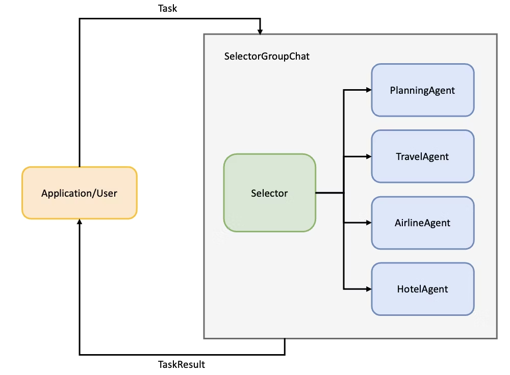

# 演習 3 : AutoGen でのマルチエージェント実装(前編)

この演習 3 で実施するタスクは以下のとおりです。
- AutoGen の概要について
- AutoGen で使う contract_lookup_agent の作成
- AutoGen で使う product_search_agent の作成
- summary_agent の作成
- planner_agent の作成

## 演習 3-0 AutoGen について
Azure AI Agent SDK で構築したシングルエージェントの構成をベースに、 AutoGen のマルチエージェント構成に書き換えていきます。

マルチエージェント実装を行う際のフレームワークについては別途解説しますが、 AutoGen は Microsoft Research が中心となって開発している OSS で、自律性の高いデザインパターンを実装することが可能です。

詳しくは [Developers Seminar の YouTube動画](https://youtu.be/vaBspzSug1A) にて解説しています。

AutoGen では基本的に AssistantAgent クラスで GroupChat における各エージェントを定義します。
実装の記述方法は自由ですが、今回は各エージェントを下記のようなモデルクライアントを引数とした関数でインスタンス化し、別ファイルから呼び出せるようにしています。

```python
def agent_name(model_client: ChatCompletionClient) -> AssistantAgent:
    agent = AssistantAgent(
        name="agent_name",
        description="エージェントの役割や呼び出せるツールを自然言語で明記します",
        model_client=model_client,
        tools = tools, # エージェントが呼び出せるツール
        system_message="""システムメッセージや指示をここで定義します""",
    )
    return agent
```

また、今回のハンズオンでは[ **Selector Group Chat** ](https://microsoft.github.io/autogen/0.4.7/reference/python/autogen_agentchat.teams.html#autogen_agentchat.teams.SelectorGroupChat)でマルチエージェントを実装していきます。[**Selector Group Chat**](https://microsoft.github.io/autogen/0.4.7/reference/python/autogen_agentchat.teams.html#autogen_agentchat.teams.SelectorGroupChat) では生成 AI モデル（LLMなど）が共有コンテキストに基づいて次のスピーカーを選択することで、動的でコンテキストを認識したコラボレーションが可能になります。

- Selector による中央集権的なエージェント割り振り
- 遷移先の決定: LLM+ルール
- スレッド: メッセージスレッドを共有



AutoGenの他のマルチエージェントデザインパターンについては、[Developers Seminar の YouTube動画](https://youtu.be/vaBspzSug1A) および下記のブログで紹介されています。
- [AutoGen v0.4 マルチエージェントデザインパターン実装メモ① Selector によるエージェント選択](https://qiita.com/nohanaga/items/164d70e4c50c1ce2cd4c)
- [AutoGen v0.4 マルチエージェントデザインパターン実装メモ② Swarm による効率的エージェント選択](https://qiita.com/nohanaga/items/9bd32514655f142b23c6)
- [AutoGen v0.4 マルチエージェントデザインパターン実装メモ③ Magentic-One エージェント進捗台帳のススメ](https://qiita.com/nohanaga/items/28fcf00a23e990ac3551)

### コーディングの手順を飛ばして実行の様子を確認したい方
<details>
<summary>実行のみを行う手順</summary>

1. autogen-multiagent フォルダに移動\
``` cd autogen-multiagent ``` 

2. 下記コマンドで app.py を実行\
```chainlit run app.py -w```

3. `http://localhost:8000` でchainlit の UI が表示されるので、次のようなタスクを入力してみてください。
```
ユーザーID 1234 の人の加入しているプランを調べ、そのプランの詳細を教えて
```

4. 実行結果が UI 上に表示されます
</details>

## 演習 3-1 contract_lookup_agent.py の作成
この手順では Azure AI Agent SDK を用いて
1. ```mkdir multi-agent``` でmulti-agent フォルダを作成します。
2. ターミナルで ```cd multi-agent``` を実行し、ディレクトリを移動します。
3. **（重要）これ以降の手順は全て `multi-agent` ディレクトリ内で作業してください。**
4. 新規ファイルで `contract_lookup_agent.py` を作成します。
5. 必要なモジュールをインポートする文をファイルの先頭に追加します。

```python
import requests
import json
import os
import asyncio
from autogen_agentchat.agents import AssistantAgent
from autogen_core.models import ChatCompletionClient
```
6. 次に、Azure AI Agent SDK の際に記述した、契約管理DBを検索する関数を定義します

7. 下記の contract_lookup 関数を追加
※データをハードコードした関数になっていますが、Cosmos DB から取得する関数でも問題ございません。

```python
def contract_lookup(user_id: int)->str:
    # 便宜上ハードコードしています。Cosmos DB から取得する関数でも構いません。
    """
    ユーザーIDに基づいてユーザー情報を JSON 文字列で返す

    :param user_id (int): ユーザーのID
    :rtype: int

    :return: JSON 文字列のユーザー情報.
    :rtype: str
    """
    mock_users = {
        1234: {
            "name": "佐藤太郎",
            "tel": "090-0000-0000",
            "email": "sato@example.com",
            "staff_email": "xxxxxxxx@microsoft.com",
            "plan": "安心保障プラン",
        },
        5679: {
            "name": "鈴木花子",
            "tel": "080-1111-1111",
            "email": "suzuki@example.com",
            "staff_email": "xxxxxxxx@microsoft.com",
            "plan": "学資サポートプラン",
        },
        4321: {
            "name": "田中次郎",
            "tel": "090-2222-2222",
            "email": "tanaka@example.com",
            "staff_email": "xxxxxxxx@microsoft.com",
            "plan": "シニアライフプラン",
        }
    }
    user_info = mock_users.get(user_id, {"error": "User not found."})
    return json.dumps({"user_info": user_info})
```

8. 担当者にメールを送信する send_email 関数についても同様に追加
```python
def send_email(customer: str, staff_email: str, inquiry: str) -> str:
    """
    お客様から担当者のメールアドレスにお問い合わせがあったことを通知

    :param customer (str): お客様の名前
    :rtype: str

    :param staff_email (str) : 担当者のメールアドレス
    :rtype: str

    :param inquiry (str) : 保険に関するお問い合わせ内容
    :rtype: str

    :return: JSON 文字列のユーザー情報.
    :rtype: str
    """
    headers = {'Content-Type': 'application/json'}
    payload = {
        "customer": customer,
        "inquiry": inquiry,
        "staff_email": staff_email
    }

    endpoint_url = os.getenv("LOGIC_APPS")

    try:
        response = requests.post(endpoint_url, headers=headers, data=json.dumps(payload))
        response.raise_for_status() 
        status = json.dumps({"status": "メールで通知が完了しました"})
        return status
    except requests.exceptions.RequestException as err:
        print(f"エラー: {err}")
        return json.dumps({"status": "メールで通知に失敗しました"})
```
9. 次に AutoGen の AssistantAgent クラスで使えるように tools の定義を行います。この記述方法は Azure AI Agent SDK と異なる点です。今回は2つしか関数を定義していませんが、下記のような形に倣って自分で追加することも可能です。
``` python
tools = [contract_lookup, send_email]
```
10. 最後に AssistantAgent のインスタンスを作成するための関数を定義します。システムメッセージなどは独自に改善していただいて大丈夫です。
```python
def contract_lookup_agent(model_client: ChatCompletionClient) -> AssistantAgent:
    agent = AssistantAgent(
        name="ContractLookupAgent",
        description="顧客のデータを確認し、保険の契約状況と担当者を確認するエージェント。さらにユーザーからリクエストがあった場合、ユーザーの担当者に連絡をする。",
        model_client=model_client,
        tools = tools,
        system_message="""丁寧に返してください""",
    )
    return agent

```

## 演習 3-2 product_search_agent.py の作成
実施するタスクとしては contract_lookup_agent.py と同じ流れです
1. 新規ファイルで product_search_agent.py を作成してください
2. 必要なモジュールのインポート
    - Azure AI Search SDK を用いるため、 Azure の認証のための機能を使います
```python
import json
import os
from dotenv import load_dotenv
from azure.core.credentials import AzureKeyCredential
from azure.search.documents import SearchClient

from autogen_agentchat.agents import AssistantAgent
from autogen_core.models import ChatCompletionClient
```

3. 環境変数の読み込みと Azure AI Search のクライアント定義
```python
load_dotenv()
AI_SEARCH_ENDPOINT = os.getenv("AI_SEARCH_ENDPOINT")
INDEX_NAME = os.getenv("INDEX_NAME")
AI_SEARCH_KEY = os.getenv("AI_SEARCH_KEY")

search_client = SearchClient(
    endpoint=AI_SEARCH_ENDPOINT, index_name=INDEX_NAME, credential=AzureKeyCredential(AI_SEARCH_KEY)
)
```

4. 検索結果を整形するための nonewlines 関数の定義 (任意)
    - この関数はツールとしては呼び出しません
```python
def nonewlines(s: str) -> str:
    return s.replace("\n", " ").replace("\r", " ").replace("[", "【").replace("]", "】")
```

5.　Azure AI Search のインデックスを検索する product_search 関数の定義
```python
def product_search(query: str) -> str:
    """
    保険の商品に関する質問に関して、Azure AI Search の検索結果を返します。

    :param query (str): 保険の商品を検索する際のクエリ
    :rtype: str

    :return: JSON 文字列の検索結果の情報
    :rtype: str
    """

    results = search_client.search(
        search_text=query,
        query_type="semantic",
        semantic_configuration_name="insurance-product-info-semantic-configuration",  # セマンティック検索用の構成名（環境に合わせて変更
        top=3
    )
    context = [nonewlines(doc['chunk']) for doc in results]
    context_json = json.dumps({"context": context})
    print(context_json)
    return context_json
```

6. Grounding with Bing Search および Code Interpreter は今回のマルチエージェント実装では用いません
7. 関数を tool として登録
```python
tools = [product_search]
```

8. AssistantAgent のインスタンスを作成するための関数を定義します。システムメッセージなどは独自に改善していただいて大丈夫です。
```python
def product_search_agent(model_client: ChatCompletionClient) -> AssistantAgent:
    agent = AssistantAgent(
        name="ProductSearchAgent",
        description="顧客のデータを確認し、保険の契約状況と担当者を確認するエージェント。さらにユーザーからリクエストがあったばあい、ユーザーの担当者に連絡をする。",
        model_client=model_client,
        tools=tools,
        system_message="""json形式でかえしてください""",
    )
    return agent
```

## 演習 3-3 summary_agent.py の作成
このエージェントは、エージェント同士の回答を要約して、最終回答を生成するエージェントです。
1. summary_agent.py ファイルを新規作成

AutoGen のマルチエージェント実装では、タスクの終了条件を指定する必要があります。 [8 つの組み込みの終了条件](https://microsoft.github.io/autogen/stable/user-guide/agentchat-user-guide/tutorial/termination.html#)があり、今回はタスクが完了したと判定場合に "TERMINATE" という文字列を生成させることで終了判定をします。従って、summary_agent.py の要件は以下です。

- 要約エージェントはマルチエージェントの会話の終了条件となる、`"TERMINATE"`という文字列を最後に生成させます
- 要約エージェントでは、tool の呼び出しは行いません
- これまでの会話履歴を要約し、最終回答としてまとめます

2. ここで、要約エージェントはプロンプトを工夫して自分で実装してみてください。ひな形は下記です。必要に応じて Copilot などをご活用ください。


```python
from autogen_agentchat.agents import AssistantAgent
from autogen_core.models import ChatCompletionClient

def summary_agent(model_client: ChatCompletionClient) -> AssistantAgent:

    sumamry_agent = # この部分を記述してみてください。記述の例は折りたたんであります。

    return sumamry_agent
```
<details>
<summary>記述例を表示</summary>

```python
from autogen_agentchat.agents import AssistantAgent
from autogen_core.models import ChatCompletionClient

def summary_agent(model_client: ChatCompletionClient) -> AssistantAgent:

    sumamry_agent = AssistantAgent(
        name="SummaryAgent",
        description="これまでの会話履歴を要約する AI アシスタント",
        model_client=model_client,
        system_message="""
あなたのタスクは、他の team members が収集した情報をもとに、これまでの会話履歴の要約を作成することです。

## 回答ルール

- ユーザーからの質問に対して、他の team member が収集した情報を使って適切な回答を作成してください。
- 作成後、最終回答の文章の最後に "TERMINATE" と入力して、タスクを完了します。
"""
    )

    return sumamry_agent
```
</details>


## 演習 3-4 planner_agent.py の作成
ここまでで、契約DBを検索するエージェント、商品データを検索するエージェント、要約エージェントができました。
次に、ユーザーからの入力に対して、タスクを完了するために必要な計画を立てる planner agent を作成します。
ここでは特に、システムプロンプトが重要になります。どんなエージェントが、それぞれどのような役割で、何ができるエージェントなのかを記述します。

1. planner_agents.py ファイルを新規作成し、以下を記述してください
```python
from autogen_agentchat.agents import AssistantAgent


def planner_agent(model_client) -> AssistantAgent:
    return AssistantAgent(
        name="PlannerAgent",
        description="与えられたタスクを完了するためのサブタスクを計画する Agent。計画を立てるだけでサブタスクの実行は行いません。",
        model_client=model_client,
        system_message="""ユーザーの質問を適切に回答するためのサブタスクを計画する AI アシスタントです。

- あなたはサブタスクの実行をしてはいけません。サブタスクの計画を作成することのみがあなたの役割です。
- サブタスクを作成するためのあなたの team members は以下です。:
  - contract_lookup_agent: ユーザーの保険加入状況データベースを検索して、回答を行うエージェント。ユーザーの担当者に連絡を送ることができます。
  - product_search_agnet: 保険の商品について、商品説明の資料を検索して、回答を行うエージェント。
  - SummaryAgent: 他の team members からの情報をもとにユーザーへ最終回答を作成・校正を実行することができます。

## サブタスクの計画方法

- あなたの役割は、team members を使って出張計画を作成するためのサブタスクを計画することです。
- サブタスクの実行は必ず team mebers に委任して行います。
- サブタスクの最後は、必ず SummaryAgent に対して、ユーザーへ回答するための出張計画の作成を依頼します。

サブタスクの計画は以下のフォーマットで行います:

1. <agent> : <task>
2. <agent> : <task>
...


## "計画" について
最後に Summary Agent にこれまでの会話履歴の要約を依頼します。
""",
    )

```

以上で4つのエージェントが作成できました。\
後編では、これらのエージェントのオーケストレーションを行い、簡単なUIを作成します。

<br>

## 次へ

👉 [**演習 4:　AutoGen でのマルチエージェント実装(後編)**](ex4.md) 

<br>

<hr>

🏚️ [README に戻る](../README.md)