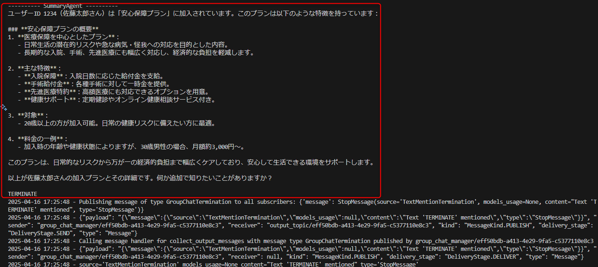
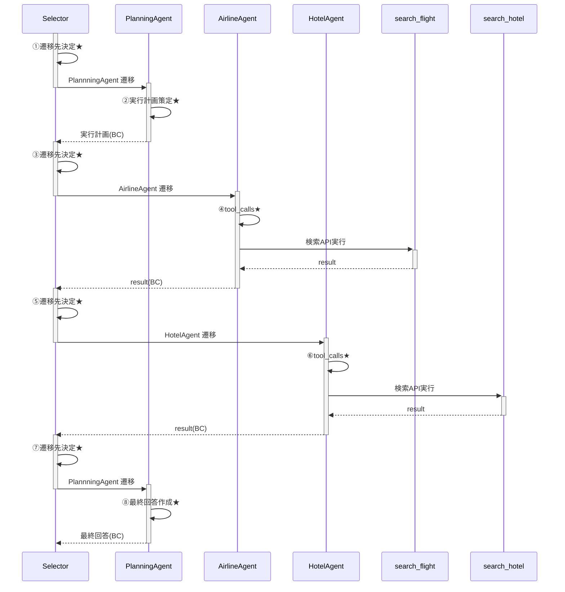
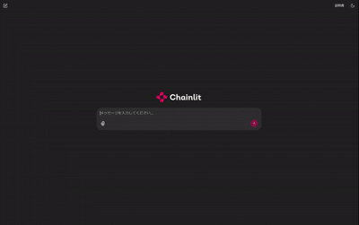

# 演習 4 : AutoGen でのマルチエージェント実装(後編)

この演習 4 で実施するタスクは以下のとおりです。
- app.py を作成し、GroupChat 部分を実装
- chainlit による簡易的な UI 作成

## 演習 4-1 : app.py の作成
### 作成したエージェントをモジュールとしてインポート
1. `multi-agent` ディレクトリと同じ階層に app.py を新規作成してください
1. 各種必要な AutoGen のモジュールをインポートします
1. app.py の先頭に以下を記述してください。これ以降コードをコピペする際は、最下部に足していってください。
```　python
import json
import os
import chainlit as cl
from dotenv import load_dotenv
from autogen_agentchat.teams import SelectorGroupChat
from autogen_ext.models.openai import AzureOpenAIChatCompletionClient
from autogen_agentchat.conditions import TextMentionTermination, MaxMessageTermination
from autogen_agentchat.ui import Console
from autogen_agentchat.base import TaskResult
from autogen_agentchat.messages import TextMessage,ToolCallExecutionEvent, ToolCallRequestEvent
```

4. 前編で作成した4つのエージェントをモジュールとして読み込みます
```　python
from agents.contract_lookup_agent import contract_lookup_agent
from agents.product_search_agent import product_search_agent
from agents.summary_agent import summary_agent
from agents.planner_agent import planner_agent
```

5. 環境変数の読み込み
```python
load_dotenv()
AZURE_OPENAI_KEY = os.getenv("AZURE_OPENAI_KEY")
AZURE_OPENAI_ENDPOINT = os.getenv("AZURE_OPENAI_ENDPOINT")
DEPLOYMENT_NAME = os.getenv("DEPLOYMENT_NAME")
AI_SEARCH_ENDPOINT = os.getenv("AI_SEARCH_ENDPOINT")
INDEX_NAME = os.getenv("INDEX_NAME")
AI_SEARCH_CRED = os.getenv("AI_SEARCH_CRED")
```

6. LLM クライアントの定義\
※ 今回は AutoGen のバージョンを 0.4.7 に指定しているため、autogen_ext.models.openai モジュールの [AzureOpenAIChatCompletionClient](https://microsoft.github.io/autogen/0.4.7/reference/python/autogen_ext.models.openai.html#autogen_ext.models.openai.AzureOpenAIChatCompletionClient) を使っています。\
執筆時最新の AutoGen 0.5系の場合は [AzureAIChatCompletionClient](https://microsoft.github.io/autogen/stable/reference/python/autogen_ext.models.azure.html#module-autogen_ext.models.azure) を用います。

```python
aoai_client = AzureOpenAIChatCompletionClient(
    azure_deployment=DEPLOYMENT_NAME,
    model="gpt-4o",
    api_key=AZURE_OPENAI_KEY,
    api_version="2025-01-01-preview",
    azure_endpoint=AZURE_OPENAI_ENDPOINT,
)
```

7. Selector Group Chat 作成時のプロンプト指定\
Selector Group Chat 作成時に指定するプロンプトとして以下を定義します。プロンプトには次のようなプレースホルダーを使用することができます：​

|プレースホルダー|説明|
|---------------|---|
|{roles}|各エージェントの名前とその説明が挿入されます。|
|{participants}|参加しているエージェントの名前のリストが挿入されます。|
|{history}|これまでの会話履歴が挿入されます。​|


```python
selector_prompt = """あなたのタスクは、会話の状況に応じて次のタスクを実行する role を選択することです。
## 次の話者の選択ルール

各 role の概要以下です。

{roles}

次のタスクに選択可能な participants は以下です。

{participants}

以下のルールに従って、次のを選択してください。

- 会話履歴を確認し、次の会話に最適な role を選択します。role name のみを返してください。
- role は1つだけ選択してください。
- 他の role が作業を開始する前に、"PlannerAgent" にタスクを割り当て、サブタスクを計画してもらうことが必要です。
  - PlannerAgent はサブタスクの計画のみを行います。サブタスクの作業を依頼してはいけません。
- PlannerAgent が計画したサブタスクに応じて、role を選択します。
- タスクを完了するための必要な情報が揃ったと判断したら "SummaryAgent" に最終回答の作成を依頼します。
```

8. 各エージェントに、モデルクライアントを引数に渡す\
演習3で作成した各エージェントをモジュールとして読み込み、モデルクライアントの定義を引数に渡すことで各エージェントを作成します。

```python
planner = planner_agent(aoai_client)
product_search = product_search_agent(aoai_client)
contract_lookup = contract_lookup_agent(aoai_client)
summary = summary_agent(aoai_client)
```

9. マルチエージェントの終了条件の定義\
演習3で触れたように、 AutoGen には 無限ループを防止するため [8 つの組み込みの終了条件](https://microsoft.github.io/autogen/stable/user-guide/agentchat-user-guide/tutorial/termination.html#)が定義されています。終了条件は以下のように OR 条件で指定できるのが便利です。 \
今回は「応答に "TERMINATE" が含まれる」もしくは「最大生成メッセージ数が 10」という条件にしています。

```python
termination_condition = TextMentionTermination("TERMINATE") | MaxMessageTermination(10)
```

10. Selector Group Chat の定義
``` python
team = SelectorGroupChat(
    [
        planner,
        product_search,
        contract_lookup,
        summary,
    ],
    model_client=aoai_client,
    termination_condition=termination_condition,
    selector_prompt=selector_prompt,
    allow_repeated_speaker=False,
)
```

## 演習4-2 : 実行部分の実装
ここまでで各エージェントの定義および、Selector Group Chat の作成ができました。
UIを構築する前に、実行ができるか確認しましょう。

1. 実行時の出力を見やすくする関数
```python
async def clean_console(stream):
    async for message in stream:
        if isinstance(message, TextMessage):
            print(
                f"\n ----------------: {message.source}----------------: \n {message.content}"
            )
        elif isinstance(message, ToolCallRequestEvent):
            print(
                f"\n ----------------: {message.source}----------------: \n 呼び出すツール: {message.content[0].name} \n パラメータ: {message.content[0].arguments}"
            )
        elif isinstance(message, ToolCallExecutionEvent):
            print(
                f"\n ----------------: {message.source}----------------: \n ツール呼び出し結果: {message.content[0].content.encode().decode('unicode_escape')} "
            )

```

2. 実行部分 

[`run_stream(task=task)`](https://microsoft.github.io/autogen/0.4.7/reference/python/autogen_agentchat.teams.html#autogen_agentchat.teams.BaseGroupChat.run_stream) のメソッドで、Selector Group Chat にユーザーからのタスクが渡されます。

``` python
async def main():
    task = "ユーザーID 1234 の人の加入しているプランを調べ、プランの詳細も調べて教えて"
    await clean_console(team.run_stream(task=task))

if __name__ == "__main__":
    asyncio.run(main())
```

コンソールに経過や Azure ログが出力されます。\
少し見づらいですが、以下のような最終回答が表示されていればOKです。


処理としては次のようなシーケンス図となります。


## 演習4-3 : chainlit による UI 構築
今回作成する UI は [Chainlit](https://docs.chainlit.io/get-started/overview) を採用しています。python で LLM を用いたチャット UI を手軽に構築できるフレームワークです。

UI を記述する際、先ほどの実行部分のコードは不要なのでコメントアウトしましょう。
``` python
"""
async def main():
    task = "ユーザーID 1234 の人の加入しているプランを調べ、プランの詳細も調べて教えて"
    await clean_console(team.run_stream(task=task))

if __name__ == "__main__":
    asyncio.run(main())
"""
```

1. UI 部分を記述

`@cl.on_message` が chainlit でメッセージが送信されたときに実行される関数を定義します。今回は非常に簡易的な記述をしていますが、チャットの開始、終了、再開時の処理や、スタート画面のカスタマイズ、ボタンの表示などもできます。

以下の内容を、ファイルの下部に追加してください。\
このコードでは `run_stream` を実行し、そのメッセージの内容を次の場合わけで表示させています。

| メッセージの内容 | 値 |  UI 表示内容 | 
| --- | --- | --- | 
| テキストメッセージ | TextMessage | エージェント名、テキスト |
| ツール呼びだし |ToolCallRequestEvent |  エージェント名、呼び出すツール、パラメータ |
| ツール実行結果 |ToolCallExecutionEvent | エージェント名、実行結果 |

```python
@cl.on_message
async def main(message: cl.Message) -> None:
    task = message.content

    try:
        # Run the async generator and collect the results
        stream = team.run_stream(task=task)

        if not hasattr(stream, "__aiter__"):
            raise TypeError("Expected an async generator, but got a non-iterable object.")

        async for message in stream:
            if isinstance(message, TaskResult):
                print(f"TaskResult: {message.stop_reason}")
                # await cl.Message(content=f"Final Output: {message.stop_reason}").send()
            elif isinstance(message, TextMessage):
                response = {"source": message.source, "text": message.content}
                print(f"TextMessage: {message.source}: {message.content}")
                await cl.Message(content=f"エージェント：{message.source}: \n {message.content}").send()
            elif isinstance(message, ToolCallRequestEvent):
                print(f"ToolCall: {message}")
                await cl.Message(
                    content=f"エージェント: {message.source} \n 呼び出すツール: {message.content[0].name} \n パラメータ: {message.content[0].arguments} "
                ).send()
            elif isinstance(message, ToolCallExecutionEvent):
                print(f"ToolCall: {message}")
                await cl.Message(
                    content=f"エージェント: {message.source} \n ツール呼び出し結果: {message.content[0].content.encode().decode('unicode_escape')} "
                ).send()
    except TypeError as e:
        print(f"Error: {e}")

```

ここまでで、コーディングは終了です。

2. タスクの実行
下記のコマンドで、実行を行います。
```
chainlit app.py run -w
```
既定では `http://localhost:8000` で UI が表示されます。
ブラウザ上で `http://localhost:8000` にアクセスし、タスクを入力してみましょう。
```
ユーザーID 1234 の人の加入しているプランを調べ、プランの詳細も調べて教えて
```

次のように、Planner Agent によって計画が立てられ、計画に沿って各エージェントにメッセージの受け渡しがされ、適切な Tool Call がされ、最終回答が得られるような挙動となればOKです。他のタスクを試しても構いませんが、各エージェントのプロンプトは調整しておりませんので、各自任意でカスタマイズしてみてください。

 \
gifが見づらい場合は[こちらの動画](../images/multiagent.mp4)をご覧ください。

今回は簡易的な実装のため、ブラウザタブを閉じても、サーバーサイドで非同期処理を実行している関係で、コンソール上では処理が続いてしまいます。完全に終了する場合は、ターミナルで `Ctrl + C` で終了させてください。

<br>


## 次へ

👉 [**演習5: エージェントの実装における考慮点**](ex5.md) 

<br>

<hr>

🏚️ [README に戻る](../README.md)