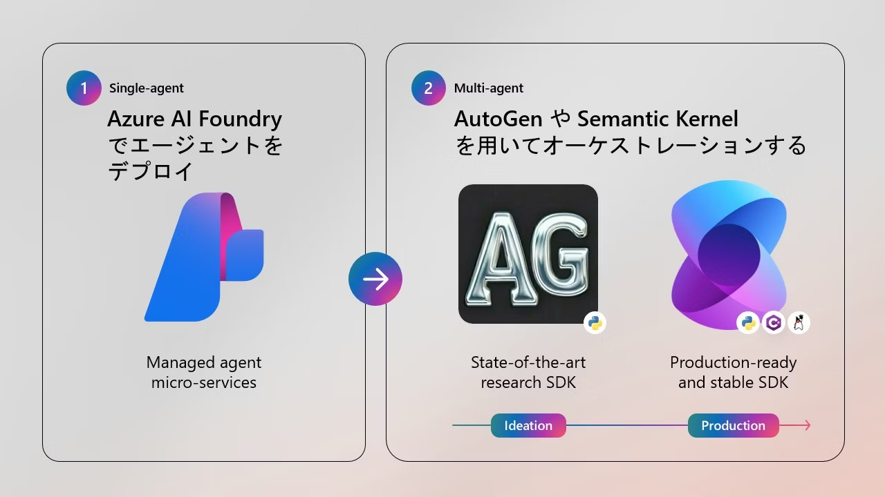

# 演習 5: エージェント実装における考慮点と Semantic Kernel でのマルチエージェント実装

## ハンズオンパートのまとめ
演習4までで AutoGen を用いたマルチエージェント実装は終了です。お疲れ様でした。\
ここまでで下記の内容を実施しました。

0. [事前準備とリソースの作成](ex0.md)
1. [保険商品案内エージェントの作成](ex1.md)
2. [契約管理エージェントの作成](ex2.md)
3. [AutoGen でのマルチエージェント実装(前編)](ex3.md)
4. [AutoGen でのマルチエージェント実装(後編)](ex4.md)

ツールとして RAG を構築し、Logic Apps や CosmosDB などの Azure PaaS サービスをエージェントと連携させる方法を学びました。
既に作成している検索インデックスと連携したり、今回のコードをカスタマイズしてお使いいただくこともできます。

AutoGen はいかがでしょうか。
ビジネスでマルチエージェント実装をする際、AutoGen といったフレームワークは 最新のエージェントデザインパターンが試せる点は魅力な一方で、破壊的変更の可能性があったりと、ビジネスで堅牢な構成にするには様々な考慮点がございます。\
また 2024年 11月に実施された Ignite では下記のように、最新の技術を用いる場合は AutoGen を、運用環境向けの構成には Semantic Kernel を採用するといった紹介もありました。

Semantic Kernel のハンズオンは次の Qiita のリンクにございます。

### [Semantic Kernel Agent Frameworkでマルチエージェント実装手法を解説](https://qiita.com/matayuuu/items/56de2b699bb5b38aac5f)

※以下準備中 TBU
---

- アクセス制御
- ログ監視
- セキュリティ

### UI について
- [UX Design for Agents](https://microsoft.design/articles/ux-design-for-agents/)
- [すぐに使えるマルチエージェント時代の UI を考えるメモ](https://qiita.com/nohanaga/items/b346870131e82832eb1f)
- [Chainlit と MCP サーバーについて](https://docs.chainlit.io/advanced-features/mcp)

 - Optional : [Azure Acrive Directory による認証](https://docs.chainlit.io/authentication/oauth#azure-active-directory)

## 参考リンク
- Chainlit と AutoGen の [cookbook](https://github.com/Chainlit/cookbook/tree/main/pyautogen)
- 

🏚️ [README に戻る](../README.md)